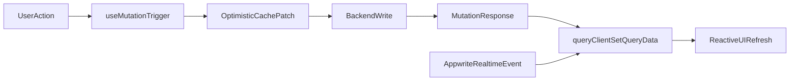

I’m going to inspect `unified_backend_bluprint.md` first, then map its requirements to your current Next.js/Appwrite codebase and start implementing it directly. I’ll flag any blockers/questions only when they’re necessary to continue.


**File Glob Results:**

- **C:\CCodes_WebDevelopment\Full Stack CodeBases\ShipORShink\ship_or_shink\docs\frontend_integration_plan.md**
- **C:\CCodes_WebDevelopment\Full Stack CodeBases\ShipORShink\ship_or_shink\docs\unified_backend_blueprint.md**
- **C:\CCodes_WebDevelopment\Full Stack CodeBases\ShipORShink\ship_or_shink\component_to_build\DESIGN.md**
- **C:\CCodes_WebDevelopment\Full Stack CodeBases\ShipORShink\ship_or_shink\docs\architecture.md**
- **C:\CCodes_WebDevelopment\Full Stack CodeBases\ShipORShink\ship_or_shink\docs\checkpoint-qr-mapping.md**
- **C:\CCodes_WebDevelopment\Full Stack CodeBases\ShipORShink\ship_or_shink\docs\development.md**
- **C:\CCodes_WebDevelopment\Full Stack CodeBases\ShipORShink\ship_or_shink\docs\treasure-hunt-game-specification.md**


I found the blueprint file (`docs/unified_backend_blueprint.md`). Next I’ll read it along with your existing backend-related files so I can implement against your current structure instead of guessing.


**Files Read:**

**C:\CCodes_WebDevelopment\Full Stack CodeBases\ShipORShink\ship_or_shink\docs\unified_backend_blueprint.md**
```
# Unified Backend Blueprint for Frontend Integration

This document merges:
- `backend_implementation.md`
- `frontend_integration_plan.md`

It is the single implementation contract for backend development with frontend-first integration guarantees.

---

## 1) Mismatch Report and Resolution Log

### A. API Endpoint Mismatches

1. **Vote Endpoint**
- Backend (previous): `POST /api/votes`
- Frontend: `POST /api/projects/{projectId}/reactions`
- **Final Decision:** `POST /api/projects/{projectId}/reactions`
- **Reason:** Aligns with Next.js route structure and keeps frontend-backend mapping intuitive.

2. **Submission Endpoint**
- Backend (previous): `POST /api/projects`
- Frontend: `POST /api/submit`
- **Final Decision:** `POST /api/submit`
- **Reason:** Simpler routing and better alignment with frontend folder structure.

3. **Project Detail Lookup**
- Backend (previous): Not explicitly defined
- Frontend: Slug-based routing required
- **Final Decision:** `GET /api/projects/{projectIdOrSlug}`
- **Reason:** Supports both ID and slug for flexibility while maintaining stable frontend routing

### B. Request/Response Shape Mismatches

1. Vote payload shape
- Backend: `projectId`, `rating`, `liked`, `comment`, assignment validation
- Frontend: `reactionType`, `clientEventId`
- Resolution:
  - Canonical vote DTO supports both:
    - domain fields (`projectId`, `rating`, `liked`, `comment`)
    - adapter fields (`reactionType`, `clientEventId`)
  - Controller maps `reactionType` into backend scoring semantics.
  - `clientEventId` retained for idempotency.

2. Envelope mismatch
- Backend doc: `{ ok, data, error }`
- Integration requirement: `{ success, data, error }`
- Resolution:
  - Transitional envelope (mandatory):
    - success response: `{ ok: true, success: true, data, error: null }`
    - error response: `{ ok: false, success: false, data: null, error: { code, message, details? } }`
  - Reason: enables non-breaking migration for existing consumers.

3. List response mismatch
- Frontend expects pagination object.
- Backend list shape previously under-defined.
- Resolution:
  - `GET /api/projects` returns:
    - `data.items`
    - `data.pageInfo { page, limit, total, hasNext }`
  - Reason: predictable query cache behavior with TanStack Query.

### C. Data Model Mismatches

1. Slug field missing in backend project schema
- Resolution: add `projects.slug` as required unique indexed field.

2. Assignment awareness mismatch
- Backend has strict `review_assignments` checks for valid registered votes; frontend does not mention it.
- Resolution: keep assignment check mandatory for registered valid votes; frontend remains assignment-agnostic.

3. Counter semantics mismatch
- Backend separates `totalVoteCount` and `validVoteCount`; frontend references generic reaction stats.
- Resolution: expose the totalvoteCount in API and realtime , hide the validVoteCount keep it only for server.

### D. Naming Inconsistencies

- `vote` (frontend) vs `vote` (backend)
  - Resolution: backend domain term is `vote`; compatibility route keeps frontend naming stable.
- `ok` vs `success`
  - Resolution: dual-key transitional envelope.

---

## 2) Final API Contract

### Global Response Envelope (All Endpoints)

```json
{
  "ok": true,
  "success": true,
  "data": {},
  "error": null
}
```

Error:

```json
{
  "ok": false,
  "success": false,
  "data": null,
  "error": {
    "code": "INVALID_INPUT",
    "message": "Validation failed",
    "details": {}
  }
}
```

### Contract Table

| Endpoint | Method | Request | Response | Used By (Frontend File) |
| --- | --- | --- | --- | --- |
| `/api/projects` | GET | Query: `page`, `limit`, `sort?`, `order?`, filters? | `data: { items: ProjectListItem[], pageInfo: { page, limit, total, hasNext } }` | `features/projects/hooks/useProjects.ts` |
| `/api/projects/{projectIdOrSlug}` | GET | Path param: id or slug | `data: ProjectDetail` including `totalVoteCount`, `validVoteCount`, `avgRating?`, `updatedAt`, `version` | `features/projects/hooks/useProjectDetail.ts` |
| `/api/projects` | POST | `multipart/form-data`: `projectName`, `tagline`, `teamName`, `description`, `githubRepo`, `videoDemo`, `liveUrl`, `visualPayload?` (+ mapped backend fields) | `data: { projectId, status, submittedAt, slug }` | `features/submission/hooks/useSubmitProject.ts` |
| `/api/votes` | POST | JSON: `{ projectId, rating?, liked?, comment?, reactionType?, clientEventId?, roundId? }` | `data: { projectId, voteAcceptedAs, totalVoteCount, validVoteCount, updatedAt, version }` | `features/projects/hooks/useVote.ts` (via API service adapter) |
| `/api/projects/{projectId}/reactions` | POST | JSON: `{ reactionType, clientEventId }` | Same as `/api/votes` response | `features/projects/hooks/useVote.ts` (legacy compatibility path) |
| `/api/projects/{projectId}/stats` | GET | Path param: `projectId` | `data: { projectId, totalVoteCount, validVoteCount, avgRating?, updatedAt, version }` | `features/realtime/useProjectRealtime.ts` fallback refresh |
| `/api/assignments/me` | GET | Auth session required | `data: { roundId, assignments: AssignedProject[] }` | Optional future review UI (no current hard dependency) |
| `/api/assignments/generate` | POST | Admin JSON: `{ roundId, reviewsPerTeam }` | `data: { roundId, generatedCount, skippedCount }` | Admin operations (out of current user-facing flows) |

### Canonical Error Codes

- `UNAUTHENTICATED` (401)
- `INVALID_INPUT` (400)
- `RATE_LIMITED` (429)
- `TEAM_REQUIRED` (403)
- `TEAM_NOT_REGISTERED` (403)
- `PROJECT_NOT_FOUND` (404)
- `SELF_VOTE_FORBIDDEN` (403)
- `NOT_ASSIGNED` (403)
- `FORBIDDEN` (403)
- `INTERNAL_ERROR` (500)

---

## 3) Final Data Model (Merged)

## 3.1 Users

Fields:
- `userId` (string, PK; equals Appwrite auth user id)
- `email` (string, required, unique)
- `displayName` (string, required)
- `teamId` (string, nullable FK -> `teams.teamId`)
- `role` (enum `LEADER|MEMBER`, nullable until assignment)
- `isRegistered` (boolean, default `false`)
- `createdAt` (datetime, required)
- `updatedAt` (datetime, required)

Relationships:
- Many users -> one team
- One user -> zero/one team membership row (enforced by membership unique)

Constraints:
- Unique: `email`
- Indexes: `teamId`, `role`, `isRegistered`

## 3.2 Teams

Fields:
- `teamId` (string, PK)
- `name` (string, required)
- `createdByUserId` (string, required FK -> `users.userId`)
- `createdAt` (datetime, required)
- `status` (enum `active|inactive`, default `active`)

Relationships:
- One team -> many users
- One team -> many membership records
- One team -> one active project

Constraints:
- Business: exactly one active leader at a time
- Indexes: `name`, `createdByUserId`

## 3.3 Projects

Fields:
- `projectId` (string, PK)
- `slug` (string, required, unique)
- `teamId` (string, required FK -> `teams.teamId`)
- `ownerUserId` (string, required FK -> `users.userId`)
- `title` (string, required)
- `description` (string, required)
- `repoUrl` (string, optional)
- `demoUrl` (string, optional)
- `assetFileIds` (array/string list, optional)
- `submittedAt` (datetime, required)
- `status` (enum `draft|submitted|locked`, default `submitted`)
- `totalVoteCount` (integer, required, default `0`)
- `validVoteCount` (integer, required, default `0`)
- `avgRating` (float, optional cached field)
- `updatedAt` (datetime, required)
- `version` (integer, required, default `1`)

Relationships:
- One project belongs to one team
- One project has many votes
- One project may appear in many review assignments

Constraints:
- Unique: `teamId` (one active project per team)
- Unique: `slug`
- Indexes: `submittedAt`, `status`, `teamId`, `slug`

## 3.4 Votes

Fields:
- `voteId` (string, optional deterministic PK)
- `roundId` (string, required)
- `reviewerTeamId` (string, required FK -> `teams.teamId`)
- `projectId` (string, required FK -> `projects.projectId`)
- `userId` (string, required for registered valid vote path)
- `rating` (integer, optional when boolean-like mode is used)
- `liked` (boolean, optional)
- `comment` (string, optional)
- `clientEventId` (string, optional idempotency token)
- `createdAt` (datetime, required)
- `updatedAt` (datetime, required)

Relationships:
- Many votes -> one project
- Many votes -> one registered user (for valid vote rows)
- Many votes -> one reviewer team

Constraints:
- Unique composite: (`userId`, `projectId`) for first valid registered vote guarantee
- Optional unique on deterministic `voteId`
- Indexes: `projectId`, `userId`, `reviewerTeamId`, `roundId`

## 3.5 Supporting Collection: ReviewAssignments

`review_assignments` is required for authorization of registered valid votes.

Fields:
- `assignmentId` (deterministic)
- `roundId`
- `reviewerTeamId`
- `projectId`
- `assignedAt`
- `active`

Constraints:
- Unique composite: (`roundId`, `reviewerTeamId`, `projectId`)
- Indexes: (`reviewerTeamId`, `active`), (`projectId`, `active`), `roundId`

---

## 4) Business Logic Alignment (Authoritative)

## 4.1 Voting Logic

Validation order (must be exact):
1. Rate-limit gate
2. Payload validation
3. Project existence + status validation

Decision branches:

1. Guest vote (unregistered)
- Increment `totalVoteCount` by 1.
- Do not insert `votes` row for valid-vote ledger.
- Do not increment `validVoteCount`.
- Return `voteAcceptedAs = "guest-click"`.

2. Registered first vote
- Resolve team membership from authenticated user.
- Reject if missing membership (`TEAM_REQUIRED`/`TEAM_NOT_REGISTERED`).
- Reject self vote (`SELF_VOTE_FORBIDDEN`) if project team matches reviewer team.
- Enforce active assignment (`NOT_ASSIGNED` when absent).
- If no existing unique vote (`userId`, `projectId`):
  - Insert vote row.
  - Increment `totalVoteCount` and `validVoteCount`.
  - Return `voteAcceptedAs = "registered-first"`.

3. Registered repeat vote
- Re-run all auth/team/self/assignment checks.
- Detect existing vote row.
- Do not insert new vote row.
- Increment only `totalVoteCount`.
- Keep `validVoteCount` unchanged.
- Return `voteAcceptedAs = "registered-repeat-click"`.

## 4.2 Team and Role Logic

- Role enum is strictly uppercase: `LEADER|MEMBER`.
- Exactly one leader per team at any moment.
- Leader transfer must be transactional (demote old + promote new atomically).
- Backend derives team authority from authenticated `userId` only; never trust client-provided `teamId`.

## 4.3 Rate Limiting

- Limit: 60 requests/minute.
- Key strategy:
  - registered: `userId`
  - guest: `ipAddress`
- Key template: `vote:{identityKey}:{minuteBucket}`.
- Apply before expensive database operations.
- Return `retryAfterSeconds` when available.

---

## 5) Realtime Integration Contract

## 5.1 Event Definition

- Primary event: `project.updated` (or Appwrite projects document update channel).
- Emit after each accepted vote branch that mutates aggregates.

Payload:
- `projectId`
- `slug`
- `totalVoteCount`
- `validVoteCount`
- `avgRating` (if maintained)
- `updatedAt`
- `version`

## 5.2 Frontend Dependencies

- Project detail consumers (`/gallery/[slug]`, `useProjectDetail`):
  - patch `["projects","detail",slug]`.
- Project list consumers (`/`, `useProjects`):
  - patch matching project row(s) in list caches.
- Voting UI/animations:
  - trigger count-change animation only after cache reflects new values.

## 5.3 Conflict Handling

- Mutation response is immediate truth for acting client.
- Realtime event reconciles cross-client consistency.
- Apply event only if event `version`/`updatedAt` is newer than local cache.
- If payload is partial, patch aggregate fields only.

---

## 6) Backend Node.js Structure and API Mapping

## 6.1 Directory Layout

```text
backend/
  routes/
    projects.routes.ts
    votes.routes.ts
    reactions.routes.ts
    assignments.routes.ts
  controllers/
    projects.controller.ts
    votes.controller.ts
    reactions.controller.ts
    assignments.controller.ts
  services/
    projects.service.ts
    voting.service.ts
    assignments.service.ts
    teams.service.ts
    realtime.service.ts
  middleware/
    auth.middleware.ts
    rateLimit.middleware.ts
    validation.middleware.ts
    error.middleware.ts
  config/
    appwrite.config.ts
    env.config.ts
    rateLimit.config.ts
    realtime.config.ts
```

## 6.2 API -> Route -> Controller -> Service Map

| API | Route File | Controller Function | Service Logic |
| --- | --- | --- | --- |
| `GET /api/projects` | `routes/projects.routes.ts` | `projects.controller.listProjects` | `projects.service.listProjects` |
| `GET /api/projects/{projectIdOrSlug}` | `routes/projects.routes.ts` | `projects.controller.getProjectDetail` | `projects.service.getByIdOrSlug` |
| `POST /api/projects` | `routes/projects.routes.ts` | `projects.controller.submitProject` | `projects.service.submitOrUpdateProject` |
| `GET /api/projects/{projectId}/stats` | `routes/projects.routes.ts` | `projects.controller.getProjectStats` | `projects.service.getProjectStats` |
| `POST /api/votes` | `routes/votes.routes.ts` | `votes.controller.submitVote` | `voting.service.submitVote` |
| `POST /api/projects/{projectId}/reactions` | `routes/reactions.routes.ts` | `reactions.controller.submitReactionAlias` | `voting.service.submitVote` (adapter mapping) |
| `GET /api/assignments/me` | `routes/assignments.routes.ts` | `assignments.controller.getMyAssignments` | `assignments.service.getAssignmentsForTeam` |
| `POST /api/assignments/generate` | `routes/assignments.routes.ts` | `assignments.controller.generateAssignments` | `assignments.service.generateDeterministicAssignments` |

---

## 7) Integration Optimization Rules

1. Response compatibility
- Return both `ok` and `success` on every endpoint until frontend migration completes.

2. Idempotency
- Accept optional `clientEventId` on vote/reaction paths.
- Prevent duplicate write effects when retries happen.

3. Versioned aggregation
- Increment project `version` on every aggregate-changing mutation.
- Include `version` and `updatedAt` in mutation responses and realtime events.

4. Compatibility endpoint lifecycle
- Keep `/api/projects/{projectId}/reactions` as temporary alias.
- Mark deprecation once frontend fully uses canonical `/api/votes`.

---

## 8) Implementation Validation Checklist

- Contract tests cover all canonical and compatibility endpoints.
- Project slug uniqueness and lookup behavior verified.
- Vote uniqueness (`userId`, `projectId`) and branch behavior verified.
- Team leader uniqueness and transactional transfer verified.
- Rate limiter enforces 60 req/min on registered and guest paths.
- Realtime payload and mutation response aggregate parity verified.
- All endpoints return dual-key envelope (`ok`, `success`) consistently.

```

**C:\CCodes_WebDevelopment\Full Stack CodeBases\ShipORShink\ship_or_shink\package.json**
```
{
  "name": "ship_or_shink",
  "version": "0.1.0",
  "private": true,
  "scripts": {
    "dev": "next dev",
    "build": "next build",
    "start": "next start",
    "lint": "eslint"
  },
  "dependencies": {
    "@tanstack/react-query": "^5.99.0",
    "fslightbox-react": "^2.0.3",
    "gsap": "^3.15.0",
    "next": "16.2.4",
    "react": "19.2.4",
    "react-dom": "19.2.4"
  },
  "devDependencies": {
    "@tailwindcss/postcss": "^4",
    "@types/node": "^20",
    "@types/react": "^19",
    "@types/react-dom": "^19",
    "eslint": "^9",
    "eslint-config-next": "16.2.4",
    "tailwindcss": "^4",
    "typescript": "^5"
  }
}

```

**C:\CCodes_WebDevelopment\Full Stack CodeBases\ShipORShink\ship_or_shink\README.md**
```
This is a [Next.js](https://nextjs.org) project bootstrapped with [`create-next-app`](https://nextjs.org/docs/app/api-reference/cli/create-next-app).

## Getting Started

First, run the development server:

```bash
npm run dev
# or
yarn dev
# or
pnpm dev
# or
bun dev
```

Open [http://localhost:3000](http://localhost:3000) with your browser to see the result.

You can start editing the page by modifying `app/page.tsx`. The page auto-updates as you edit the file.

This project uses [`next/font`](https://nextjs.org/docs/app/building-your-application/optimizing/fonts) to automatically optimize and load [Geist](https://vercel.com/font), a new font family for Vercel.

## Learn More

To learn more about Next.js, take a look at the following resources:

- [Next.js Documentation](https://nextjs.org/docs) - learn about Next.js features and API.
- [Learn Next.js](https://nextjs.org/learn) - an interactive Next.js tutorial.

You can check out [the Next.js GitHub repository](https://github.com/vercel/next.js) - your feedback and contributions are welcome!

## Deploy on Vercel

The easiest way to deploy your Next.js app is to use the [Vercel Platform](https://vercel.com/new?utm_medium=default-template&filter=next.js&utm_source=create-next-app&utm_campaign=create-next-app-readme) from the creators of Next.js.

Check out our [Next.js deployment documentation](https://nextjs.org/docs/app/building-your-application/deploying) for more details.

```


**File Glob Results:**

- **C:\CCodes_WebDevelopment\Full Stack CodeBases\ShipORShink\ship_or_shink\docs\unified_backend_blueprint.md**


The repo currently only surfaced the blueprint in docs, so I’m now scanning the full project structure to see what backend/API code already exists and what needs to be created from scratch.


**File Glob Results:**

- **C:\CCodes_WebDevelopment\Full Stack CodeBases\ShipORShink\ship_or_shink\app\gallery\[slug]\page.tsx**
- **C:\CCodes_WebDevelopment\Full Stack CodeBases\ShipORShink\ship_or_shink\app\layout.tsx**
- **C:\CCodes_WebDevelopment\Full Stack CodeBases\ShipORShink\ship_or_shink\app\page.tsx**
- **C:\CCodes_WebDevelopment\Full Stack CodeBases\ShipORShink\ship_or_shink\app\submit\page.tsx**
- **C:\CCodes_WebDevelopment\Full Stack CodeBases\ShipORShink\ship_or_shink\components\providers\QueryProvider.tsx**
- **C:\CCodes_WebDevelopment\Full Stack CodeBases\ShipORShink\ship_or_shink\features\core\components\Footer.tsx**
- **C:\CCodes_WebDevelopment\Full Stack CodeBases\ShipORShink\ship_or_shink\features\core\components\MobileNav.tsx**
- **C:\CCodes_WebDevelopment\Full Stack CodeBases\ShipORShink\ship_or_shink\features\core\components\Navbar.tsx**
- **C:\CCodes_WebDevelopment\Full Stack CodeBases\ShipORShink\ship_or_shink\features\gallery\components\GalleryCard.tsx**
- **C:\CCodes_WebDevelopment\Full Stack CodeBases\ShipORShink\ship_or_shink\features\gallery\components\GallerySection.tsx**
- **C:\CCodes_WebDevelopment\Full Stack CodeBases\ShipORShink\ship_or_shink\features\gallery\hooks\useArtifacts.ts**
- **C:\CCodes_WebDevelopment\Full Stack CodeBases\ShipORShink\ship_or_shink\features\gallery\types.ts**
- **C:\CCodes_WebDevelopment\Full Stack CodeBases\ShipORShink\ship_or_shink\features\product\components\ProductDetailLayout.tsx**
- **C:\CCodes_WebDevelopment\Full Stack CodeBases\ShipORShink\ship_or_shink\features\product\components\ProductHero.tsx**
- **C:\CCodes_WebDevelopment\Full Stack CodeBases\ShipORShink\ship_or_shink\features\product\components\ProductMedia.tsx**
- **C:\CCodes_WebDevelopment\Full Stack CodeBases\ShipORShink\ship_or_shink\features\product\components\ProductSidebar.tsx**
- **C:\CCodes_WebDevelopment\Full Stack CodeBases\ShipORShink\ship_or_shink\features\product\hooks\useProject.ts**
- **C:\CCodes_WebDevelopment\Full Stack CodeBases\ShipORShink\ship_or_shink\features\product\types.ts**
- **C:\CCodes_WebDevelopment\Full Stack CodeBases\ShipORShink\ship_or_shink\features\submission\components\BackgroundElements.tsx**
- **C:\CCodes_WebDevelopment\Full Stack CodeBases\ShipORShink\ship_or_shink\features\submission\components\ExternalLinksForm.tsx**
- **C:\CCodes_WebDevelopment\Full Stack CodeBases\ShipORShink\ship_or_shink\features\submission\components\IdentityConceptForm.tsx**
- **C:\CCodes_WebDevelopment\Full Stack CodeBases\ShipORShink\ship_or_shink\features\submission\components\ProjectDescriptionForm.tsx**
- **C:\CCodes_WebDevelopment\Full Stack CodeBases\ShipORShink\ship_or_shink\features\submission\components\SubmissionForm.tsx**
- **C:\CCodes_WebDevelopment\Full Stack CodeBases\ShipORShink\ship_or_shink\features\submission\components\SubmissionHeader.tsx**
- **C:\CCodes_WebDevelopment\Full Stack CodeBases\ShipORShink\ship_or_shink\features\submission\components\VisualPayloadDropzone.tsx**


**Files Read:**

**C:\CCodes_WebDevelopment\Full Stack CodeBases\ShipORShink\ship_or_shink\features\gallery\hooks\useArtifacts.ts**
```
"use client";

import { useQuery } from "@tanstack/react-query";
import { Artifact } from "../types";

// Mock data based on code.html
const MOCK_ARTIFACTS: Artifact[] = [
  {
    id: "1",
    tag: "WArrirors",
    title: "NEON_DRIFTER",
    description: "Recovered image from the lower levels of Sector 4. Subject displays extreme visual noise and chromatic aberration metadata suggest 199X origin.",
    imageUrl: "https://lh3.googleusercontent.com/aida-public/AB6AXuCHFPUZo6L9-xUDd6fMXmm4hnWco_JkT5FLoW5-fuXuU8BSex396NKf9oml5DquieHLBIk1GfPrEa_IwnlkVOgD8B89_oWJu0ugPSewzsFQ_PmWVdCCNTUs6B75zvjlvxZm7hk-ZSlRL5tGY1zQS15ZBzrCCJoA09AD8OFYrXsrnNBNMaKUDt7E09wBdVm3LEDsFEfpyqq1g89mdTapYkMVvdzAlkH8g95BpPNPj-llS75YBIC9Q9bQSqhC_Nn2r_nYkLgQEWevOcg",
    icons: ["memory", "encrypted"]
  },
  {
    id: "2",
    tag: "phoenix",
    title: "HARDWARE_VOID",
    description: "Legacy systems remaining from the first generation network collapse. High-density circuitry mapping indicates non-standard architecture.",
    imageUrl: "https://lh3.googleusercontent.com/aida-public/AB6AXuAQc53hvGdHjZYabSHKGi7wTghgxAOocpYD7bJeN-XGKmP5ON7uJyMiRCLqkHi7lFF4QoDWfWEqyJ5eXkHz3b--APK2iP7HPsarygJOcclqx6CMuaLg41awDWOLj7XLyJnU7dxxV1cJ6VeGQv_f_jXDK72w3rwlf0tl20n_y3LbHXPexbP8szChM4D9Qf6j4NCbG88SQmqYfyK2K6a5fLxlOKcVk3Wv7myfPw6r4TZIUPjHj3qNu-aPVNxFLwCHueZsuCd2rX_lpu8",
    icons: ["settings_input_component", "terminal"]
  },
  {
    id: "3",
    tag: "Team-x",
    title: "ANALOG_RUINS",
    description: "Photocopied paper texture with heavy ink bleeds. Fragment of the Zine_04 physical artifact recovered from the landfill sectors.",
    imageUrl: "https://lh3.googleusercontent.com/aida-public/AB6AXuDRQE-J5I2bdaDNqP6apn_zSINjbSqk71I1KFBKJFxFpP4gc01-3f7kPt-1tj7uH7J7EFQJIpwrY6EE4gNWDepUMk6hURkM4nqYFdphMvGSf2EL98gETFUlHH_yKbnWGc4yxiTssXe3oFt63HxzWdvalyznrb1utLaNzxVYa-81_Vl_n45_hlmPVT-0k-ImEV_zeJZhbLf7dZ9tgrMm-Yf0Cc4QOrfXb1QUVfxuzZwOSRPVQgwbYGlXYb63FJFXdvJLEuOyeaLQ9sY",
    icons: ["layers", "history"]
  }
];

export function useArtifacts() {
  return useQuery({
    queryKey: ["artifacts"],
    queryFn: async () => {
      // Simulate network latency
      await new Promise((resolve) => setTimeout(resolve, 500));
      return MOCK_ARTIFACTS;
    },
  });
}

```

**C:\CCodes_WebDevelopment\Full Stack CodeBases\ShipORShink\ship_or_shink\features\gallery\types.ts**
```
export interface Artifact {
  id: string;
  tag: string;
  title: string;
  description: string;
  imageUrl: string;
  icons: string[];
}

```

**C:\CCodes_WebDevelopment\Full Stack CodeBases\ShipORShink\ship_or_shink\features\product\hooks\useProject.ts**
```
"use client";

import { useQuery, useMutation } from "@tanstack/react-query";
import { ProjectDetail } from "../types";

// Mock implementation based on architecture
// In production, this would call a Next.js API Route Handler which uses Appwrite
const fetchProjectByTitle = async (titleSlug: string): Promise<ProjectDetail> => {
  // Simulate network latency & API call
  await new Promise((resolve) => setTimeout(resolve, 500));
  
  // Create a display title from slug
  const displayTitle = decodeURIComponent(titleSlug).toUpperCase().replace(/-/g, "_");

  return {
    id: "1",
    tag: "WArrirors",
    title: displayTitle,
    description: "Recovered image from the lower levels of Sector 4.",
    imageUrl: "https://lh3.googleusercontent.com/aida-public/AB6AXuDRQE-J5I2bdaDNqP6apn_zSINjbSqk71I1KFBKJFxFpP4gc01-3f7kPt-1tj7uH7J7EFQJIpwrY6EE4gNWDepUMk6hURkM4nqYFdphMvGSf2EL98gETFUlHH_yKbnWGc4yxiTssXe3oFt63HxzWdvalyznrb1utLaNzxVYa-81_Vl_n45_hlmPVT-0k-ImEV_zeJZhbLf7dZ9tgrMm-Yf0Cc4QOrfXb1QUVfxuzZwOSRPVQgwbYGlXYb63FJFXdvJLEuOyeaLQ9sY",
    icons: ["memory", "encrypted"],
    teamName: "TEAM VAPORWAVE GHOST",
    videoUrl: "https://lh3.googleusercontent.com/aida-public/AB6AXuD0Bg3AsBHkoac2VlLzFXI-Kt5zRa4uLIxhQTsIXV0cxR8pfvleqbHyBZVOeZnYrT8avoKfV1hnZOShhrGbmrZiTdfGUkmi40miFVzbeENEu-Y0NclrJPUkU6-AciN0DxZD6AO7QMaDkLPkjSEhEF_r4vM4fX2pLVJL0MYZszwcIe1xnaDzwvrlkcj3YdBjZMT068p0IwbsYZQ-bGIp5gW06KwcJGMwxq7a7Y01LL7RVSgbOyUE8t_ij-hIlQCDErsySXjSIeL1PR0",
    thumbnailUrls: [
      "https://lh3.googleusercontent.com/aida-public/AB6AXuD0Bg3AsBHkoac2VlLzFXI-Kt5zRa4uLIxhQTsIXV0cxR8pfvleqbHyBZVOeZnYrT8avoKfV1hnZOShhrGbmrZiTdfGUkmi40miFVzbeENEu-Y0NclrJPUkU6-AciN0DxZD6AO7QMaDkLPkjSEhEF_r4vM4fX2pLVJL0MYZszwcIe1xnaDzwvrlkcj3YdBjZMT068p0IwbsYZQ-bGIp5gW06KwcJGMwxq7a7Y01LL7RVSgbOyUE8t_ij-hIlQCDErsySXjSIeL1PR0",
      "https://lh3.googleusercontent.com/aida-public/AB6AXuA2Jrq-KJ4zwoP-r2CnQ1l9BHn0eowi0zWULlA8jsy5soFRC9Mkbl8QgB55zjh9HHZZUsvxECnQtTxbxJNXfNjW2jG4FNoZt-GGRZi3m8pVgpdzMv_GpE03ScZGL93MhZKhuNn1NXrbY_LojSSOGuLvcsz90aSUAdbyV0de_1Z0J9Zb04w7YYMwknvjmh9EVwiF01ZSUu_rmwmBF0tLWxxPRW2UZ_fcAvb6E2x3DNNMsKuZ8tQaYk6Lnhq1ho-rq5XJFXknTlgPqHg",
      "https://lh3.googleusercontent.com/aida-public/AB6AXuA4KEeFtGUvEJ--oaRPlHa0S09-qqeSOc0qoFGKLA55toTGclEJmIHCtf5fr4u2fYw77JpFDZ0eWG4ntpPtiTseVjMLGSaR-0a38d2CfskIJNnEv2IvGg86_W06Gg0XXSUWL03tCnH3r4PIAwlcFCNDUW_6Uz_dzJd6OEbEpbjHADsv5uyBcZA9sOMfMFil0-0jEuFE1WhYj4uOYtPVP-UM1gAfgBOIt8YQRg9eoFC78k7ArOvjsSxOM_jYCpzoVjhVY0kq9TKxL34"
    ],
    longDescription: "Chroma Synthetic is a hyper-sensory exploration of digital decay and generative synthesis. Built during the 48-hour Chaos Cycle, this project utilizes custom Three.js shaders to visualize audio frequencies in a non-Euclidean 3D space.\n\nThe interface utilizes a \"Neo-Zine\" framework, bridging the gap between tactile 90s print media and modern low-latency web interactions.",
    repoUrl: "https://github.com/example/repo",
    stats: { radical: 0, vibrant: 0, complex: 0, deadly: 0 },
    metrics: { stat1: 88, stat2: 72, stat3: 95 }
  };
};

export function useProject(titleSlug: string) {
  return useQuery({
    queryKey: ["project", titleSlug],
    queryFn: () => fetchProjectByTitle(titleSlug),
    enabled: !!titleSlug,
  });
}

export function useProjectReaction() {
  return useMutation({
    mutationFn: async ({ projectId, reactionType }: { projectId: string; reactionType: string }) => {
      // Simulate API hit to route handler
      await new Promise((resolve) => setTimeout(resolve, 500));
      return { success: true };
    },
  });
}

```

**C:\CCodes_WebDevelopment\Full Stack CodeBases\ShipORShink\ship_or_shink\features\product\types.ts**
```
import { Artifact } from "@/features/gallery/types";

export interface ProjectDetail extends Artifact {
  teamName: string;
  videoUrl?: string; // e.g., the Demo video
  thumbnailUrls: string[];
  longDescription: string;
  repoUrl?: string;
  stats: {
    radical: number;
    vibrant: number;
    complex: number;
    deadly: number;
  };
  metrics: {
    stat1: number; // primary color progress bar
    stat2: number; // secondary color progress bar
    stat3: number; // tertiary color progress bar
  }
}

```

**C:\CCodes_WebDevelopment\Full Stack CodeBases\ShipORShink\ship_or_shink\features\submission\components\SubmissionForm.tsx**
```
"use client";

import React, { useState } from "react";
import { useRouter } from "next/navigation";
import { VisualPayloadDropzone } from "./VisualPayloadDropzone";
import { ProjectDescriptionForm } from "./ProjectDescriptionForm";
import { IdentityConceptForm } from "./IdentityConceptForm";
import { ExternalLinksForm } from "./ExternalLinksForm";

export function SubmissionForm() {
  const router = useRouter();
  const [isSubmitting, setIsSubmitting] = useState(false);

  const handleSubmit = async (e: React.FormEvent<HTMLFormElement>) => {
    e.preventDefault();
    setIsSubmitting(true);
    
    try {
      // 1. Gather all form data
      const formData = new FormData(e.currentTarget);
      const payload = Object.fromEntries(formData.entries());
      
      // We also handle the file from visualPayload Dropzone
      const file = formData.get("visualPayload");
      if (file instanceof File && file.size > 0) {
        console.log("File attached:", file.name, "Size:", file.size);
      }
      
      console.log("Submitting Project Data:", payload);

      // 2. TODO: actual fetch call to the backend API
      // const response = await fetch('/api/submit', { method: 'POST', body: formData })
      // if (!response.ok) throw new Error("Submission failed")
      
      // simulate delay as requested
      await new Promise((resolve) => setTimeout(resolve, 1000));
      
      // Redirect to gallery page (gallery.jsx / page.tsx equivalent)
      router.push("/");
    } catch (error) {
      console.error("Error during submission:", error);
    } finally {
      setIsSubmitting(false);
    }
  };

  return (
    <form onSubmit={handleSubmit} className="flex flex-col lg:flex-row gap-12 items-start">
      {/* Left Side (60%): Visual Payload */}
      <div className="w-full lg:w-[60%] space-y-8">
        <VisualPayloadDropzone />
        <ProjectDescriptionForm />
      </div>
      
      {/* Right Side (40%): Form Fields and CTA */}
      <div className="w-full lg:w-[40%] space-y-10">
        <IdentityConceptForm />
        <ExternalLinksForm />
        
        {/* CTA Section */}
        <div className="pt-6">
          <button
            type="submit"
            disabled={isSubmitting}
            className="w-full group relative overflow-hidden bg-primary py-8 shadow-[12px_12px_0px_0px_rgba(56,56,51,1)] hover:shadow-[16px_16px_0px_0px_rgba(56,56,51,1)] hover:-translate-x-1 hover:-translate-y-1 transition-all disabled:opacity-80 disabled:cursor-not-allowed"
          >
            <div className="absolute inset-0 opacity-10 halftone-overlay"></div>
            <span className="relative z-10 font-headline font-black italic text-4xl uppercase tracking-tighter text-on-primary group-hover:ink-shadow">
              {isSubmitting ? "UPLOADING..." : "INITIATE UPLOAD"}
            </span>
          </button>
          <p className="text-center mt-6 font-label text-[10px] uppercase tracking-[0.2em] text-on-surface-variant font-bold leading-relaxed">
            By uploading, you acknowledge the terms of the neo-zine collective.
          </p>
        </div>
      </div>
    </form>
  );
}

```

**C:\CCodes_WebDevelopment\Full Stack CodeBases\ShipORShink\ship_or_shink\app\page.tsx**
```
import { Navbar } from "@/features/core/components/Navbar";
import { Footer } from "@/features/core/components/Footer";
import { MobileNav } from "@/features/core/components/MobileNav";
import { GallerySection } from "@/features/gallery/components/GallerySection";

export default function Home() {
  return (
    <>
      <Navbar />
      <main className="pt-24 min-h-screen">
        <GallerySection />
        <Footer />
      </main>
      <MobileNav />
    </>
  );
}

```

**C:\CCodes_WebDevelopment\Full Stack CodeBases\ShipORShink\ship_or_shink\app\gallery\[slug]\page.tsx**
```
"use client";

import { useParams } from "next/navigation";
import { useProject } from "@/features/product/hooks/useProject";
import { ProductDetailLayout } from "@/features/product/components/ProductDetailLayout";
import { Navbar } from "@/features/core/components/Navbar";
import { Footer } from "@/features/core/components/Footer";
import { MobileNav } from "@/features/core/components/MobileNav";

export default function ProjectPage() {
  const params = useParams();
  const slug = params.slug as string;
  
  const { data: project, isLoading, error } = useProject(slug);

  return (
    <>
      <Navbar />
      <div className="pt-24 min-h-screen flex flex-col">
        {isLoading ? (
          <div className="flex-1 flex flex-col items-center justify-center p-24">
            <span className="font-headline font-black text-primary text-xl animate-pulse">LOADING_DATA.SYS</span>
          </div>
        ) : error || !project ? (
          <div className="flex-1 flex flex-col items-center justify-center p-24 gap-4">
            <span className="font-headline font-black text-red-500 text-3xl">ERR_404</span>
            <span className="font-label font-bold text-on-background">DATA_NOT_FOUND</span>
          </div>
        ) : (
          <ProductDetailLayout project={project} />
        )}
      </div>
      <Footer />
      <MobileNav />
    </>
  );
}

```

**C:\CCodes_WebDevelopment\Full Stack CodeBases\ShipORShink\ship_or_shink\app\submit\page.tsx**
```
import React from "react";
import { Navbar } from "@/features/core/components/Navbar";
import { Footer } from "@/features/core/components/Footer";
import { BackgroundElements } from "@/features/submission/components/BackgroundElements";
import { SubmissionHeader } from "@/features/submission/components/SubmissionHeader";
import { SubmissionForm } from "@/features/submission/components/SubmissionForm";

export default function SubmitPage() {
  return (
    <>
      <Navbar />
      <main className="relative min-h-screen pt-24 pb-20">
        <BackgroundElements />
        <div className="w-full px-[5%] md:px-[15%] relative z-10">
          <SubmissionHeader />
          <SubmissionForm />
        </div>
      </main>
      <Footer />
    </>
  );
}

```


**File Glob Results:**

- **C:\CCodes_WebDevelopment\Full Stack CodeBases\ShipORShink\ship_or_shink\docs\frontend_integration_plan.md**
- **C:\CCodes_WebDevelopment\Full Stack CodeBases\ShipORShink\ship_or_shink\docs\architecture.md**
- **C:\CCodes_WebDevelopment\Full Stack CodeBases\ShipORShink\ship_or_shink\docs\treasure-hunt-game-specification.md**


I’ve confirmed most backend code doesn’t exist yet, so I’m pulling the frontend integration docs now to align the API payloads with your current pages/hooks before generating the backend modules.


**Files Read:**

**C:\CCodes_WebDevelopment\Full Stack CodeBases\ShipORShink\ship_or_shink\docs\frontend_integration_plan.md**
```
# Frontend Integration Plan

## 1. Overview

This guide defines how the current frontend (gallery, project detail, submission) should integrate with a real backend using Next.js App Router, TanStack Query, and GSAP, while supporting Appwrite Realtime for vote updates.

### Current Baseline
- Existing hooks are mock-based: `useArtifacts`, `useProject`, `useProjectReaction`.
- Existing pages are `/`, `/gallery/[slug]`, and `/submit`.
- Existing submission flow builds `FormData` and simulates a backend call.

### Integration Goals
- Replace mocked query/mutation logic with API service calls while preserving current component contracts.
- Make cache behavior predictable (query keys, stale times, invalidation boundaries).
- Keep vote counts synchronized through Realtime + local cache updates without full page reloads.

### Assumptions
- Backend endpoints below are integration contracts; exact implementation may still be pending.
- Appwrite Realtime is required for vote consistency across clients.
- Frontend should remain App Router-compatible with client hooks for interactivity.

## 2. API Mapping

### API to Feature Mapping

| API Contract | Method | Feature | Frontend Consumer |
| --- | --- | --- | --- |
| `/api/projects` | GET | Gallery listing | Home page (`/`) |
| `/api/projects/{slug}` | GET | Project detail | Project page (`/gallery/[slug]`) |
| `/api/projects/{projectId}/reactions` | POST | Voting/reactions | Vote controls in project sidebar |
| `/api/submissions` | POST | Project submission | Submit page (`/submit`) |

### Notes
- `GET /api/projects` replaces mocked artifacts list.
- `GET /api/projects/{slug}` replaces mocked project detail fetch.
- `POST /api/projects/{projectId}/reactions` replaces mocked reaction mutation.
- `POST /api/submissions` receives multipart form data currently collected in `SubmissionForm`.

## 3. Query & Mutation Design

### Query/Mutation Design

| Feature | Query Key | Type (Query/Mutation) | Trigger | Cache Strategy |
| --- | --- | --- | --- | --- |
| Gallery projects list | `["projects","list",filters]` | Query | Home page mount, filter/sort change | `staleTime: 30-60s`, keep previous data during filter transitions |
| Project detail | `["projects","detail",slug]` | Query | Project route mount, slug change | `staleTime: 15-30s`, scoped per slug |
| Vote/reaction submit | `["projects","vote",projectId]` (mutation key) | Mutation | User clicks vote button | Optimistic update + rollback on error; reconcile on success/realtime |
| Submission create | `["submissions","create"]` (mutation key) | Mutation | Submit form action | No long-lived cache; return status + created resource ID |

### Refetch Rules
- Refetch list query when:
  - User returns to tab and data is stale.
  - Active filters change.
  - Explicit refresh action is triggered.
- Refetch detail query when:
  - Route slug changes.
  - User returns to tab and detail data is stale.
  - Realtime signals project aggregate changed and local patch is insufficient.

### Invalidation Rules
- After successful vote mutation:
  - Prefer `queryClient.setQueryData` for `["projects","detail",slug]` and list row patch.
  - Invalidate only affected keys when backend returns normalized totals mismatch or version conflict.
- After successful submission mutation:
  - Invalidate `["projects","list",*]` only if new entry is expected to appear immediately.
  - Otherwise defer list refresh to normal stale policy.

## 4. Data Flow

### Page-by-Page Data Ownership

| Page | Fetch Location | TanStack Usage | Primary Mutations |
| --- | --- | --- | --- |
| `/` | Client component (interactive list/filter behavior) | `useQuery` for list | None (read-heavy page) |
| `/gallery/[slug]` | Client component (already dynamic + interactive) | `useQuery` for detail, `useMutation` for vote | Vote/reaction mutation |
| `/submit` | Client component (file input + form state) | `useMutation` for submit | Submission mutation |

### Flow: Home Page (`/`)
1. Page mounts.
2. List query executes (`["projects","list",filters]`).
3. UI renders loading skeleton, then populated cards.
4. User navigates to detail page with selected slug.

### Flow: Project Page (`/gallery/[slug]`)
1. Route param resolves slug.
2. Detail query executes (`["projects","detail",slug]`).
3. User clicks vote button.
4. Vote mutation runs; optimistic update can patch local counters.
5. Backend confirms persisted totals/version.
6. Cache is reconciled (`setQueryData`) and UI updates instantly.
7. Realtime event from Appwrite applies same update for all connected clients.

### Flow: Submission Page (`/submit`)
1. User fills local form state and file payload.
2. Submit mutation sends `FormData` to backend.
3. UI shows pending state and prevents duplicate submits.
4. On success: navigate to `/` and optionally trigger list refresh.
5. On error: keep form data visible and show action-oriented error message.



## 5. Realtime Strategy

### Voting Realtime Model
- Subscribe to Appwrite channel(s) for project reaction aggregate updates.
- Keep one subscription lifecycle per relevant screen (project detail, optionally list page).
- On event receive, patch query cache directly:
  - Detail key: `["projects","detail",slug]`
  - List key(s): `["projects","list",filters]` (patch only matching project row)

### Conflict/Reconciliation Policy
- Mutation response is primary immediate truth for the acting client.
- Realtime event is cross-client consistency layer.
- If payload includes `updatedAt`/`version`, apply only newer events to avoid stale overwrite.
- If event payload is partial, patch only aggregate fields (vote counts), never replace full object.

### Why No Full Reload Is Needed
- TanStack cache is the UI source for server state.
- Mutations and Realtime events both write into that cache.
- Components rerender from cache changes, so the route does not need hard refresh.

## 6. State Management

### State Ownership Rules
- Put in TanStack Query cache:
  - Project list data, project detail data, vote aggregates, server validation responses.
- Keep in local component state:
  - Form inputs, selected media thumbnail, modal open/close, temporary animation flags.
- Keep in route state/params:
  - Slug and URL-driven filters.

### Global vs Local Strategy
- Use Query cache as global server-state container.
- Avoid custom global store for data already fetched through query hooks.
- Use local state for ephemeral UI concerns only.

### Examples
- Votes and project stats: Query cache.
- Submission form text fields and file input: local component state/form control.
- `isSubmitting`, hover/focus/expanded state: local state.

## 7. UI/UX Handling

### Loading Patterns
- List and detail pages: skeleton-first for initial load, small spinner for lightweight refetch.
- Mutations: inline pending indicators on the specific action control (vote button, submit button).

### Error Patterns
- Query errors:
  - Show retry CTA and non-blocking message where possible.
  - Keep previously cached data visible during background refetch failure.
- Mutation errors:
  - Show concise actionable feedback.
  - Roll back optimistic vote state if backend rejects mutation.

### Retry Strategy
- Read queries: retry 2-3 times with exponential backoff for transient failures.
- Vote mutation: retry only for transport/network errors; avoid duplicate logical votes on domain errors.
- Submission mutation: no automatic retry; require explicit user retry after correcting issues.

### GSAP Integration Guidance
- Use GSAP on vote click for immediate tactile feedback (button pulse, counter pop).
- Trigger count-change animation only after cache value changes (mutation success or realtime patch).
- Avoid React conflicts:
  - Use refs for animated nodes.
  - Scope/cleanup animations on unmount.
  - Do not derive data state from animation state.

## 8. File Structure

### Proposed Frontend Integration Structure

```text
features/
  projects/
    hooks/
      useProjects.ts
      useProjectDetail.ts
      useVote.ts
    services/
      api.ts
    queryKeys.ts
    components/
      VoteButton.tsx
      ProjectCard.tsx
  submission/
    hooks/
      useSubmitProject.ts
    services/
      api.ts
  realtime/
    useProjectRealtime.ts
lib/
  api/
    client.ts
  query/
    queryClient.ts
    defaults.ts
```

### API to Hook to Component Mapping

| API | Hook | Typical Component Usage |
| --- | --- | --- |
| `GET /api/projects` | `useProjects` | `GallerySection`, project listing blocks |
| `GET /api/projects/{slug}` | `useProjectDetail` | `ProjectDetailLayout`, media/stats panels |
| `POST /api/projects/{projectId}/reactions` | `useVote` | `VoteButton`, reaction controls/sidebar |
| `POST /api/submissions` | `useSubmitProject` | `SubmissionForm` |

## 9. Integration Contract

## Frontend ↔ Backend Contract

### `GET /api/projects`
- Expected request:
  - Query params: `page`, `limit`, optional `sort`, optional filters.
- Expected response:
  - `{ items: ProjectListItem[], pageInfo: { page, limit, total } }`
- Frontend consumption:
  - `useProjects` query stores paged list in cache key with filter params.

### `GET /api/projects/{slug}`
- Expected request:
  - Path param: `slug`.
- Expected response:
  - `ProjectDetail` with stable identifiers and vote aggregates.
- Frontend consumption:
  - `useProjectDetail(slug)` for detail route and dependent UI sections.

### `POST /api/projects/{projectId}/reactions`
- Expected request:
  - `{ reactionType: "radical" | "vibrant" | "complex" | "deadly", clientEventId }`
- Expected response:
  - `{ projectId, stats, updatedAt, version }`
- Frontend consumption:
  - `useVote` mutation patches cache immediately and reconciles with response version.

### `POST /api/submissions`
- Expected request:
  - Multipart `FormData` including `visualPayload`, `projectName`, `tagline`, `teamName`, `description`, `githubRepo`, `videoDemo`, `liveUrl`.
- Expected response:
  - `{ submissionId, status, projectId? }`
- Frontend consumption:
  - `useSubmitProject` mutation drives pending/success/error UI and post-submit navigation.

## 10. Optimization

### Query Performance Defaults
- Projects list: `staleTime` medium (30-60s), moderate cache retention for smooth back-navigation.
- Project detail: shorter `staleTime` (15-30s) due to vote sensitivity.
- Disable aggressive `refetchOnWindowFocus` for list if realtime already active; keep it on for detail when realtime connection is unavailable.

### Refetch Minimization
- Prefer narrow invalidation (`detail` + affected list entries) over global cache busting.
- Use `setQueryData` patches for count-only changes to avoid unnecessary network calls.
- Keep query keys param-stable to prevent duplicate cache entries.

### Mutation Throughput
- Coalesce rapid vote interactions with UI lock/debounce per project.
- Use idempotency token (`clientEventId`) to prevent duplicate writes on retry.
- Batch list-row cache patches when multiple realtime events arrive in short burst windows.

### Operational Summary
- Improved: practical query/mutation lifecycle design, page-level data ownership, and realtime consistency rules.
- Added: API-to-hook/component mapping, cache invalidation/refetch matrix, GSAP-safe trigger points, and explicit frontend/backend contracts.
- Assumptions: contracts are integration-ready targets, Appwrite Realtime is mandatory for vote sync, and current mock hooks are migration placeholders.


```

**C:\CCodes_WebDevelopment\Full Stack CodeBases\ShipORShink\ship_or_shink\docs\architecture.md**
```
# Architecture overview

This document summarizes how the **Hack and Hunt** codebase is structured. Authoritative product behavior and glossary terms are in [treasure-hunt-game-specification.md](./treasure-hunt-game-specification.md).

---

## 1. Design principles

- **Feature slices:** Domain code lives under `features/<name>/` with clear roles: UI in `components/`, orchestration in `services/` (often classes), client state in `stores/` when present, shared keys in `constants/`, cross-component types in `types/`.
- **Thin routes:** `app/` pages compose feature components. `app/api/*/route.ts` handlers validate or parse input, then call feature services — they should not contain long email bodies, Appwrite calls, or duplicated business rules.
- **Integration isolation:** `lib/` talks to one external system or policy area per module (e.g. `lib/appwrite/`, `lib/http/`). `lib` does not import from `features` or `app`.
- **Server vs client:** Server Components and Route Handlers own secrets and authoritative reads. Client Components own interactivity and use TanStack Query to call APIs. Do not import server-only modules into client files.

Detailed conventions for contributors and automated tooling are in [`.cursor/rules/architecture.mdc`](../.cursor/rules/architecture.mdc).

---

## 2. Major domains

| Domain | Location | Responsibility |
|--------|----------|------------------|
| **Auth** | `features/auth/` | OAuth sign-in flow, session awareness hooks, site chrome |
| **Event registration** | `features/event-registration/` | Registration form, Appwrite persistence, welcome email orchestration |
| **Home / marketing** | `features/home/` | Hero, mission sections, event countdown constant |
| **Game** | `features/game/` | Team state, riddles, technical questions, hints, economy, admin client services, server-loaded JSON under `features/game/data/` |
| **Admin (game)** | `app/admin/teams/*`, `features/game/services/*` | Team administration UI backed by `/api/admin/*` and `AdminAuthService` |

---

## 3. Request flow (simplified)

1. **Browser** loads App Router pages; game and admin UIs use **TanStack Query** to call **Route Handlers** under `app/api/`.
2. **Route Handlers** use `getSessionAccount` / cookies where needed, then invoke **feature services** that use `node-appwrite` via `createAdminClient()` or scoped APIs.
3. **Game content** (e.g. storyline JSON) is read and validated in server-only paths so riddles and answers are not exposed in the client bundle.

---

## 4. Notable integration points

| Integration | Entry points |
|-------------|----------------|
| Appwrite (browser) | `lib/appwrite/client.ts` |
| Appwrite (server) | `lib/appwrite/server.ts`, `lib/appwrite/session-account.ts` |
| Google profile images | `app/api/image-proxy/route.ts` → `lib/http/google-user-content-image-proxy` |
| Game window & caps | `features/game/services/game-config.ts` (server-only env) |
| Ticket signing | `features/game/services/ticket-token-service.ts` |

---

## 5. QR scanning

The client page `app/qr-scan/page.tsx` uses `qr-scanner`, accepts `redirect-to` query param, and only allows navigation to prefixed paths on an internal allowlist. Decoded payload is passed as `value=` on the target URL for server-side verification on the destination flow.

---

## 6. Related documents

- [treasure-hunt-game-specification.md](./treasure-hunt-game-specification.md) — product and technical specification  
- [checkpoint-qr-mapping.md](./checkpoint-qr-mapping.md) — physical checkpoint UUIDs  
- [development.md](./development.md) — local setup and commands  

```


**File Glob Results:**

- **C:\CCodes_WebDevelopment\Full Stack CodeBases\ShipORShink\ship_or_shink\.idea\.gitignore**
- **C:\CCodes_WebDevelopment\Full Stack CodeBases\ShipORShink\ship_or_shink\.gitignore**
- **C:\CCodes_WebDevelopment\Full Stack CodeBases\ShipORShink\ship_or_shink\app\gallery\[slug]\page.tsx**
- **C:\CCodes_WebDevelopment\Full Stack CodeBases\ShipORShink\ship_or_shink\app\submit\page.tsx**
- **C:\CCodes_WebDevelopment\Full Stack CodeBases\ShipORShink\ship_or_shink\eslint.config.mjs**
- **C:\CCodes_WebDevelopment\Full Stack CodeBases\ShipORShink\ship_or_shink\next.config.ts**
- **C:\CCodes_WebDevelopment\Full Stack CodeBases\ShipORShink\ship_or_shink\tsconfig.json**


**Files Read:**

**C:\CCodes_WebDevelopment\Full Stack CodeBases\ShipORShink\ship_or_shink\tsconfig.json**
```
{
  "compilerOptions": {
    "target": "ES2017",
    "lib": ["dom", "dom.iterable", "esnext"],
    "allowJs": true,
    "skipLibCheck": true,
    "strict": true,
    "noEmit": true,
    "esModuleInterop": true,
    "module": "esnext",
    "moduleResolution": "bundler",
    "resolveJsonModule": true,
    "isolatedModules": true,
    "jsx": "react-jsx",
    "incremental": true,
    "plugins": [
      {
        "name": "next"
      }
    ],
    "paths": {
      "@/*": ["./*"]
    }
  },
  "include": [
    "next-env.d.ts",
    "**/*.ts",
    "**/*.tsx",
    ".next/types/**/*.ts",
    ".next/dev/types/**/*.ts",
    "**/*.mts"
  ],
  "exclude": ["node_modules"]
}

```

**C:\CCodes_WebDevelopment\Full Stack CodeBases\ShipORShink\ship_or_shink\next.config.ts**
```
import type { NextConfig } from "next";

const nextConfig: NextConfig = {
  /* config options here */
};

export default nextConfig;

```

**C:\CCodes_WebDevelopment\Full Stack CodeBases\ShipORShink\ship_or_shink\eslint.config.mjs**
```
import { defineConfig, globalIgnores } from "eslint/config";
import nextVitals from "eslint-config-next/core-web-vitals";
import nextTs from "eslint-config-next/typescript";

const eslintConfig = defineConfig([
  ...nextVitals,
  ...nextTs,
  // Override default ignores of eslint-config-next.
  globalIgnores([
    // Default ignores of eslint-config-next:
    ".next/**",
    "out/**",
    "build/**",
    "next-env.d.ts",
  ]),
]);

export default eslintConfig;

```

**C:\CCodes_WebDevelopment\Full Stack CodeBases\ShipORShink\ship_or_shink\.gitignore**
```
# See https://help.github.com/articles/ignoring-files/ for more about ignoring files.

# dependencies
/node_modules
/.pnp
.pnp.*
.yarn/*
!.yarn/patches
!.yarn/plugins
!.yarn/releases
!.yarn/versions

# testing
/coverage

# next.js
/.next/
/out/

# production
/build

# misc
.DS_Store
*.pem

# debug
npm-debug.log*
yarn-debug.log*
yarn-error.log*
.pnpm-debug.log*

# env files (can opt-in for committing if needed)
.env*

# vercel
.vercel

# typescript
*.tsbuildinfo
next-env.d.ts

```


**Files Read:**

**C:\CCodes_WebDevelopment\Full Stack CodeBases\ShipORShink\ship_or_shink\features\submission\components\IdentityConceptForm.tsx**
```
import React from "react";

export function IdentityConceptForm() {
  return (
    <section className="space-y-6">
      <div className="flex items-center gap-4">
        <span className="bg-on-background text-surface font-headline font-black px-3 py-1 text-xl">
          01
        </span>
        <h3 className="font-headline font-bold uppercase text-2xl tracking-tighter">
          Identity & Concept
        </h3>
      </div>
      <div className="space-y-6">
        <div className="relative">
          <label className="font-label font-bold text-[10px] uppercase tracking-widest text-primary absolute -top-2 left-3 bg-white px-2 z-10">
            Project Name
          </label>
          <input
            required
            name="projectName"
            className="w-full bg-surface-container-low border-b-2 border-outline-variant focus:border-primary outline-none px-4 py-4 font-headline font-bold text-xl uppercase placeholder:text-outline-variant/50 transition-all"
            placeholder="THE NEURAL BREAKER"
            type="text"
          />
        </div>
        <div className="relative">
          <label className="font-label font-bold text-[10px] uppercase tracking-widest text-primary absolute -top-2 left-3 bg-white px-2 z-10">
            Tagline
          </label>
          <input
            required
            name="tagline"
            className="w-full bg-surface-container-low border-b-2 border-outline-variant focus:border-primary outline-none px-4 py-4 font-body font-medium placeholder:text-outline-variant/50 transition-all"
            placeholder="DECODING THE VIBE SHIFT"
            type="text"
          />
        </div>
        <div className="relative">
          <label className="font-label font-bold text-[10px] uppercase tracking-widest text-primary absolute -top-2 left-3 bg-white px-2 z-10">
            Team Name
          </label>
          <input
            required
            name="teamName"
            className="w-full bg-surface-container-low border-b-2 border-outline-variant focus:border-primary outline-none px-4 py-4 font-headline font-bold uppercase placeholder:text-outline-variant/50 transition-all"
            placeholder="Z-GRAVITY COLLECTIVE"
            type="text"
          />
        </div>
      </div>
    </section>
  );
}

```

**C:\CCodes_WebDevelopment\Full Stack CodeBases\ShipORShink\ship_or_shink\features\submission\components\ProjectDescriptionForm.tsx**
```
import React from "react";

export function ProjectDescriptionForm() {
  return (
    <section className="space-y-6">
      <div className="flex items-center gap-4">
        <span className="bg-on-background text-surface font-headline font-black px-3 py-1 text-xl">
          02
        </span>
        <h3 className="font-headline font-bold uppercase text-2xl tracking-tighter">
          Project Description
        </h3>
      </div>
      <div className="relative">
        <textarea
          name="description"
          required
          className="w-full bg-surface-container-low border-b-2 border-outline-variant focus:border-primary outline-none px-4 py-4 font-body leading-relaxed placeholder:text-outline-variant/50 transition-all"
          placeholder="Describe the artifact's purpose within the Neo-Zine Archive..."
          rows={12}
        ></textarea>
      </div>
    </section>
  );
}

```

**C:\CCodes_WebDevelopment\Full Stack CodeBases\ShipORShink\ship_or_shink\features\submission\components\ExternalLinksForm.tsx**
```
import React from "react";

export function ExternalLinksForm() {
  return (
    <section className="space-y-6">
      <div className="flex items-center gap-4">
        <span className="bg-on-background text-surface font-headline font-black px-3 py-1 text-xl">
          03
        </span>
        <h3 className="font-headline font-bold uppercase text-2xl tracking-tighter">
          External Links
        </h3>
      </div>
      <div className="grid grid-cols-1 gap-4">
        <div className="flex items-center gap-3 bg-surface-container-high p-1 border-b-2 border-outline-variant focus-within:border-primary transition-colors">
          <span
            className="material-symbols-outlined px-3 text-primary"
            style={{ fontVariationSettings: "'FILL' 1" }}
          >
            terminal
          </span>
          <input
            name="githubRepo"
            className="flex-1 bg-transparent border-none outline-none py-3 font-label text-sm uppercase tracking-tight"
            placeholder="GitHub Repository"
            type="url"
          />
        </div>
        <div className="flex items-center gap-3 bg-surface-container-high p-1 border-b-2 border-outline-variant focus-within:border-primary transition-colors">
          <span
            className="material-symbols-outlined px-3 text-primary"
            style={{ fontVariationSettings: "'FILL' 1" }}
          >
            play_circle
          </span>
          <input
            name="videoDemo"
            className="flex-1 bg-transparent border-none outline-none py-3 font-label text-sm uppercase tracking-tight"
            placeholder="Video Demo Link"
            type="url"
          />
        </div>
        <div className="flex items-center gap-3 bg-surface-container-high p-1 border-b-2 border-outline-variant focus-within:border-primary transition-colors">
          <span
            className="material-symbols-outlined px-3 text-primary"
            style={{ fontVariationSettings: "'FILL' 1" }}
          >
            language
          </span>
          <input
            name="liveUrl"
            className="flex-1 bg-transparent border-none outline-none py-3 font-label text-sm uppercase tracking-tight"
            placeholder="Live Project URL"
            type="url"
          />
        </div>
      </div>
    </section>
  );
}

```

**C:\CCodes_WebDevelopment\Full Stack CodeBases\ShipORShink\ship_or_shink\features\submission\components\VisualPayloadDropzone.tsx**
```
import React from "react";

export function VisualPayloadDropzone() {
  return (
    <section>
      <label className="font-headline font-bold uppercase text-lg tracking-tight mb-4 block">
        Artifact Thumbnail / Video Preview
      </label>
      <div className="relative group comic-panel">
        <div className="aspect-video bg-surface-container-highest overflow-hidden flex flex-col items-center justify-center text-center p-8 transition-transform group-hover:-translate-x-1 group-hover:-translate-y-1">
          
          <div className="relative z-10 flex flex-col items-center">
            <span
              className="material-symbols-outlined text-6xl text-primary mb-4"
              style={{ fontVariationSettings: "'FILL' 1" }}
            >
              add_photo_alternate
            </span>
            <p className="font-headline font-extrabold uppercase text-2xl leading-tight text-on-background">
              Drop Your Visual Payload Here
            </p>
            <p className="font-label text-xs mt-4 uppercase tracking-widest text-on-surface-variant">
              JPG / PNG / GIF / MP4 • MAX 10MB (16:9 Recommended)
            </p>
            <input 
              type="file" 
              name="visualPayload"
              id="visualPayload"
              className="hidden" 
              accept="image/jpeg, image/png, image/gif, video/mp4" 
            />
            <button
              type="button"
              onClick={() => document.getElementById('visualPayload')?.click()}
              className="mt-8 border-2 border-on-background px-8 py-3 font-headline font-bold uppercase hover:bg-on-background hover:text-surface transition-colors bg-white cursor-pointer z-20"
            >
              Select File
            </button>
          </div>
        </div>
      </div>
    </section>
  );
}

```

**C:\CCodes_WebDevelopment\Full Stack CodeBases\ShipORShink\ship_or_shink\features\gallery\components\GallerySection.tsx**
```
"use client";

import React from "react";
import { useArtifacts } from "../hooks/useArtifacts";
import { GalleryCard } from "./GalleryCard";

export function GallerySection() {
  const { data: artifacts, isLoading } = useArtifacts();

  return (
    <section className="py-24 px-6 md:px-12 bg-surface">
      <div className="flex flex-col md:flex-row justify-between items-end mb-16 gap-4">
        <div>
          <h2 className="font-headline font-black text-6xl md:text-7xl tracking-tighter uppercase italic leading-none mb-2 text-on-background">
            The Artifact Gallery
          </h2>
          <div className="flex items-center gap-2">
            <span className="w-16 h-2 bg-primary"></span>
            <span className="font-label text-sm text-primary font-black uppercase tracking-widest">
              Archive_01_Visuals
            </span>
          </div>
        </div>
      </div>

      {isLoading ? (
        <div className="w-full text-center py-20 font-headline text-2xl font-black uppercase animate-pulse">
          Loading Data...
        </div>
      ) : (
        <div className="grid grid-cols-1 md:grid-cols-2 lg:grid-cols-3 gap-12">
          {artifacts?.map((artifact, index) => (
            <GalleryCard 
              key={artifact.id} 
              artifact={artifact} 
              index={index} 
            />
          ))}
        </div>
      )}
    </section>
  );
}

```

**C:\CCodes_WebDevelopment\Full Stack CodeBases\ShipORShink\ship_or_shink\features\gallery\components\GalleryCard.tsx**
```
"use client";

import React, { useRef, useEffect } from "react";
import Image from "next/image";
import Link from "next/link";
import { Artifact } from "../types";
import gsap from "gsap";

interface GalleryCardProps {
  artifact: Artifact;
  index: number;
}

export function GalleryCard({ artifact, index }: GalleryCardProps) {
  const cardRef = useRef<HTMLDivElement>(null);

  useEffect(() => {
    if (cardRef.current) {
      gsap.fromTo(
        cardRef.current,
        { opacity: 0, y: 50 },
        { 
          opacity: 1, 
          y: 0, 
          duration: 0.6, 
          ease: "back.out(1.7)", 
          delay: index * 0.1 
        }
      );
    }
  }, [index]);

  return (
    <div 
      ref={cardRef}
      className="equal-card comic-panel bg-white p-8 flex flex-col group transition-all duration-300 hover:-translate-x-1 hover:-translate-y-1 hover:shadow-2xl"
    >
      <div className="absolute -top-4 -left-4 bg-primary text-white px-4 py-1 font-label text-xs font-black uppercase tracking-widest border-2 border-black z-10 transition-colors group-hover:bg-on-background">
        {artifact.tag}
      </div>
      <div className="flex-grow flex flex-col space-y-6">
        <div className="h-52 w-full bg-black border-4 border-black overflow-hidden relative">
          
          <div className="absolute inset-0 halftone-bg opacity-10 pointer-events-none"></div>
        </div>
        <div>
          <h3 className="font-headline font-black text-3xl tracking-tighter text-on-background uppercase mb-4 group-hover:text-primary transition-colors">
            {artifact.title}
          </h3>
          <p className="font-body text-sm text-on-background font-medium leading-relaxed">
            {artifact.description}
          </p>
        </div>
      </div>
      <div className="mt-6 pt-6 border-t-4 border-black flex justify-between items-center bg-surface-variant transition-colors group-hover:bg-surface-container">
        <div className="flex gap-4">
          {artifact.icons.map((icon, i) => (
            <span key={i} className="material-symbols-outlined text-on-background font-black group-hover:text-primary transition-colors">
              {icon}
            </span>
          ))}
        </div>
        <Link href={`/gallery/${encodeURIComponent(artifact.title.toLowerCase().replace(/\s+/g, '-'))}`} className="font-headline font-black text-sm uppercase tracking-widest text-primary hover:underline transition-all">
          View
        </Link>
      </div>
    </div>
  );
}

```

**C:\CCodes_WebDevelopment\Full Stack CodeBases\ShipORShink\ship_or_shink\features\product\components\ProductSidebar.tsx**
```
"use client";

import React, { useRef, useEffect } from "react";
import gsap from "gsap";
import { useProjectReaction } from "../hooks/useProject";

/**
 * ProductSidebar.tsx
 * Purpose: Contains the "Reaction Station" analytics bars and the unified action area (external links).
 * Props: projectId (string), metrics (object), repoUrl (string)
 * Backend Integration:
 * - Metrics are passed in from the parent TanStack Query response.
 * - Reactions trigger `useProjectReaction` mutation to update the backend database asynchronously.
 */
interface ProductSidebarProps {
  projectId: string;
  metrics: {
    stat1: number;
    stat2: number;
    stat3: number;
  };
  repoUrl?: string;
}

export function ProductSidebar({ projectId, metrics, repoUrl }: ProductSidebarProps) {
  const containerRef = useRef<HTMLElement>(null);
  const { mutate: reactToProject } = useProjectReaction();

  useEffect(() => {
    if (containerRef.current) {
      gsap.fromTo(
        containerRef.current.children,
        { opacity: 0, x: 50 },
        { opacity: 1, x: 0, duration: 0.8, stagger: 0.15, ease: "power2.out", delay: 0.4 }
      );
    }
  }, []);

  const handleReaction = (type: string) => {
    reactToProject({ projectId, reactionType: type });
  };

  return (
    <aside ref={containerRef} className="w-full lg:w-[420px] space-y-12">
      {/* Reaction Station */}
      <section className="bg-white p-10 comic-border">
        <h3 className="font-headline font-black text-2xl text-on-background mb-10 flex items-center gap-3">
          <span className="material-symbols-outlined text-primary">analytics</span> REACTION STATION
        </h3>
        
        <div className="space-y-10">
          <div className="space-y-3">
            <div className="flex justify-between font-label font-black text-xs uppercase tracking-tighter">
              <span><br /></span>
              <span className="text-primary">%</span>
            </div>
            <div className="h-4 bg-surface-container border-2 border-on-background relative overflow-hidden">
              <div className="absolute top-0 left-0 h-full bg-primary transition-all duration-1000" style={{ width: `${metrics.stat1}%` }}></div>
            </div>
          </div>
          
          <div className="space-y-3">
            <div className="flex justify-between font-label font-black text-xs uppercase tracking-tighter">
              <span><br /></span>
              <span className="text-secondary"><br /></span>
            </div>
            <div className="h-4 bg-surface-container border-2 border-on-background relative overflow-hidden">
              <div className="absolute top-0 left-0 h-full bg-secondary transition-all duration-1000" style={{ width: `${metrics.stat2}%` }}></div>
            </div>
          </div>
          
          <div className="space-y-3">
            <div className="flex justify-between font-label font-black text-xs uppercase tracking-tighter">
              <span><br /></span>
              <span className="text-tertiary"><br /></span>
            </div>
            <div className="h-4 bg-surface-container border-2 border-on-background relative overflow-hidden">
              <div className="absolute top-0 left-0 h-full bg-tertiary transition-all duration-1000" style={{ width: `${metrics.stat3}%` }}></div>
            </div>
          </div>
        </div>

        <div className="mt-12 grid grid-cols-2 gap-4">
          <button onClick={() => handleReaction('radical')} className="bg-white hover:bg-on-background hover:text-white border-2 border-on-background py-5 font-headline font-black uppercase text-sm transition-colors">
            🤘 Radical
          </button>
          <button onClick={() => handleReaction('vibrant')} className="bg-white hover:bg-on-background hover:text-white border-2 border-on-background py-5 font-headline font-black uppercase text-sm transition-colors">
            ✨ Vibrant
          </button>
          <button onClick={() => handleReaction('complex')} className="bg-white hover:bg-on-background hover:text-white border-2 border-on-background py-5 font-headline font-black uppercase text-sm transition-colors">
            🌀 Complex
          </button>
          <button onClick={() => handleReaction('deadly')} className="bg-white hover:bg-on-background hover:text-white border-2 border-on-background py-5 font-headline font-black uppercase text-sm transition-colors">
            💀 Deadly
          </button>
        </div>
      </section>

      {/* Unified Action Area */}
      <div className="space-y-4">
        <div className="bg-primary p-8 comic-border text-white text-center space-y-6">
          <div className="space-y-1">
            <p className="font-headline font-black text-xs tracking-[0.2em] uppercase opacity-70">SYSTEM_DEPLOYED</p>
            <h2 className="font-headline font-black text-5xl uppercase leading-none tracking-tighter">LAUNCH</h2>
          </div>
          <button className="w-full bg-white text-primary py-4 font-headline font-black text-lg uppercase hover:scale-[1.02] transition-transform border-2 border-on-background">
            ENTER THE VOID
          </button>
        </div>
        
        {repoUrl && (
          <a href={repoUrl} target="_blank" rel="noopener noreferrer" className="flex items-center justify-between bg-on-background text-white p-6 border-2 border-on-background hover:bg-primary transition-colors group">
            <div className="flex items-center gap-3">
              <span className="material-symbols-outlined">terminal</span>
              <span className="font-headline font-black text-sm uppercase">VIEW_REPOSITORY</span>
            </div>
            <span className="material-symbols-outlined group-hover:translate-x-1 transition-transform">east</span>
          </a>
        )}
      </div>
    </aside>
  );
}

```

**C:\CCodes_WebDevelopment\Full Stack CodeBases\ShipORShink\ship_or_shink\features\product\components\ProductDetailLayout.tsx**
```
"use client";

import React from "react";
import { ProductHero } from "./ProductHero";
import { ProductMedia } from "./ProductMedia";
import { ProductSidebar } from "./ProductSidebar";
import { ProjectDetail } from "../types";

/**
 * ProductDetailLayout.tsx
 * Purpose: A flexible, responsive container component that orchestrates `ProductHero`, `ProductMedia`, and `ProductSidebar` together on the Product Detail page.
 * Props: project (ProjectDetail object)
 * Backend Integration: It expects a fully hydrated `ProjectDetail` object from the API layer (via TanStack Query).
 */
interface ProductDetailLayoutProps {
  project: ProjectDetail;
}

export function ProductDetailLayout({ project }: ProductDetailLayoutProps) {
  return (
    <main className="max-w-[1440px] mx-auto px-8 py-16">
      <div className="flex flex-col lg:flex-row gap-16">
        {/* Main Content Area */}
        <div className="flex-1 space-y-12 overflow-hidden">
          <ProductHero title={project.title} teamName={project.teamName} />
          <ProductMedia 
            videoUrl={project.videoUrl} 
            thumbnailUrls={project.thumbnailUrls} 
            description={project.longDescription} 
          />
        </div>

        {/* Sidebar */}
        <ProductSidebar 
          projectId={project.id} 
          metrics={project.metrics} 
          repoUrl={project.repoUrl} 
        />
      </div>
    </main>
  );
}

```

**C:\CCodes_WebDevelopment\Full Stack CodeBases\ShipORShink\ship_or_shink\features\product\components\ProductHero.tsx**
```
"use client";

import React, { useRef, useEffect } from "react";
import gsap from "gsap";

/**
 * ProductHero.tsx
 * Purpose: Displays the hero section of the product detail page with the skewed title and team name.
 * Props: title (string), teamName (string)
 * Backend Integration: These props should be populated from the fetched project details via TanStack Query.
 */
interface ProductHeroProps {
  title: string;
  teamName: string;
}

export function ProductHero({ title, teamName }: ProductHeroProps) {
  const containerRef = useRef<HTMLDivElement>(null);

  useEffect(() => {
    if (containerRef.current) {
      gsap.fromTo(
        containerRef.current,
        { opacity: 0, x: -50 },
        { opacity: 1, x: 0, duration: 0.8, ease: "power3.out" }
      );
    }
  }, []);

  return (
    <section ref={containerRef}>
      <div className="bg-surface-container p-12 comic-border">
        <h1 
          className="font-headline font-black text-6xl md:text-8xl text-primary uppercase leading-[0.85] tracking-tighter mb-8 lg:text-7xl" 
          style={{ transform: "skew(-2deg)" }}
        >
          {title.split('_').map((word, index, arr) => (
            <React.Fragment key={index}>
              {word}
              {index < arr.length - 1 && <br />}
            </React.Fragment>
          ))}
        </h1>
        <div className="flex items-center gap-4 pt-4">
          <span className="font-label font-black text-xl text-secondary uppercase tracking-tight">
            BY {teamName}
          </span>
        </div>
      </div>
    </section>
  );
}

```


I’ve gathered the blueprint and current codebase context; next I’m creating a concrete implementation plan, then I’ll execute it directly in your repo with Next.js route handlers plus Appwrite-backed services.


**Documents Created:**

**Document 5dcf1094-7c7f-42ab-9d25-45aa83b65ce8**
```
# Problem statement
Implement the backend contract defined in `docs/unified_backend_blueprint.md` so the current Next.js application has production-style API endpoints, validation, vote business rules, dual-key envelopes, and Appwrite-backed persistence.
# Current state
The repository currently has frontend pages/hooks and no real backend modules or API route handlers for projects, submissions, votes, reactions, assignments, or stats. Existing hooks use mocked data (`features/gallery/hooks/useArtifacts.ts`, `features/product/hooks/useProject.ts`), and submission uses a simulated request (`features/submission/components/SubmissionForm.tsx`).
# Proposed changes
Create a backend layer under `backend/` with config, middleware, controllers, routes, services, and shared response/error helpers, then wire Next.js route handlers in `app/api/*` to those route adapters. Implement Appwrite integration via server SDK clients and environment-driven collection IDs for users, teams, projects, votes, and review assignments. Enforce the blueprint contract for endpoint shapes, canonical error codes, rate-limiting (60/min by user or IP), slug/id project lookup, dual-key envelope (`ok` and `success`), assignment-aware vote authorization, guest vs registered vote branches, and aggregate/version updates.
Add compatibility and alias behavior required by the blueprint: `POST /api/projects/{projectId}/reactions` as vote adapter and `POST /api/submit` for frontend submission compatibility while preserving `POST /api/projects` submission support. Include stats and assignments endpoints, idempotency support through `clientEventId`, and realtime payload shaping using project document updates as the event source. Update project dependencies and provide an environment template so the backend can be configured against an Appwrite instance without hard-coded IDs.
```


UpdateTodos: 6 items


**Diff:**
```diff
--- C:\CCodes_WebDevelopment\Full Stack CodeBases\ShipORShink\ship_or_shink\backend\utils\errors.ts
+++ C:\CCodes_WebDevelopment\Full Stack CodeBases\ShipORShink\ship_or_shink\backend\utils\errors.ts
@@ -0,0 +1,45 @@
+export type ErrorCode =
+  | "UNAUTHENTICATED"
+  | "INVALID_INPUT"
+  | "RATE_LIMITED"
+  | "TEAM_REQUIRED"
+  | "TEAM_NOT_REGISTERED"
+  | "PROJECT_NOT_FOUND"
+  | "SELF_VOTE_FORBIDDEN"
+  | "NOT_ASSIGNED"
+  | "FORBIDDEN"
+  | "INTERNAL_ERROR";
+
+export class AppError extends Error {
+  readonly code: ErrorCode;
+  readonly status: number;
+  readonly details?: unknown;
+  readonly retryAfterSeconds?: number;
+
+  constructor(input: {
+    code: ErrorCode;
+    message: string;
+    status: number;
+    details?: unknown;
+    retryAfterSeconds?: number;
+  }) {
+    super(input.message);
+    this.code = input.code;
+    this.status = input.status;
+    this.details = input.details;
+    this.retryAfterSeconds = input.retryAfterSeconds;
+  }
+}
+
+export function isAppError(value: unknown): value is AppError {
+  return value instanceof AppError;
+}
+
+export function invalidInput(message: string, details?: unknown) {
+  return new AppError({
+    code: "INVALID_INPUT",
+    message,
+    status: 400,
+    details,
+  });
+}

--- C:\CCodes_WebDevelopment\Full Stack CodeBases\ShipORShink\ship_or_shink\backend\utils\ids.ts
+++ C:\CCodes_WebDevelopment\Full Stack CodeBases\ShipORShink\ship_or_shink\backend\utils\ids.ts
@@ -0,0 +1,10 @@
+import { createHash } from "crypto";
+
+export function createDeterministicId(seed: string, prefix = "id"): string {
+  const digest = createHash("sha256").update(seed).digest("hex").slice(0, 24);
+  return `${prefix}_${digest}`.slice(0, 36);
+}
+
+export function buildMinuteBucket(now = Date.now()): number {
+  return Math.floor(now / 60_000);
+}

--- C:\CCodes_WebDevelopment\Full Stack CodeBases\ShipORShink\ship_or_shink\backend\config\env.config.ts
+++ C:\CCodes_WebDevelopment\Full Stack CodeBases\ShipORShink\ship_or_shink\backend\config\env.config.ts
@@ -0,0 +1,29 @@
+import "server-only";
+
+const asInt = (value: string | undefined, fallback: number): number => {
+  if (!value) {
+    return fallback;
+  }
+  const parsed = Number.parseInt(value, 10);
+  return Number.isFinite(parsed) ? parsed : fallback;
+};
+
+export const env = {
+  appwriteEndpoint: process.env.APPWRITE_ENDPOINT ?? "",
+  appwriteProjectId: process.env.APPWRITE_PROJECT_ID ?? "",
+  appwriteApiKey: process.env.APPWRITE_API_KEY ?? "",
+  appwriteDatabaseId: process.env.APPWRITE_DATABASE_ID ?? "",
+  appwriteUsersCollectionId: process.env.APPWRITE_USERS_COLLECTION_ID ?? "",
+  appwriteTeamsCollectionId: process.env.APPWRITE_TEAMS_COLLECTION_ID ?? "",
+  appwriteProjectsCollectionId: process.env.APPWRITE_PROJECTS_COLLECTION_ID ?? "",
+  appwriteVotesCollectionId: process.env.APPWRITE_VOTES_COLLECTION_ID ?? "",
+  appwriteReviewAssignmentsCollectionId:
+    process.env.APPWRITE_REVIEW_ASSIGNMENTS_COLLECTION_ID ?? "",
+  appwriteStorageBucketId: process.env.APPWRITE_STORAGE_BUCKET_ID ?? "",
+  voteRateLimitPerMinute: asInt(process.env.VOTE_RATE_LIMIT_PER_MINUTE, 60),
+  idempotencyTtlSeconds: asInt(process.env.VOTE_IDEMPOTENCY_TTL_SECONDS, 600),
+  adminUserIds: (process.env.ADMIN_USER_IDS ?? "")
+    .split(",")
+    .map((value) => value.trim())
+    .filter(Boolean),
+};

--- C:\CCodes_WebDevelopment\Full Stack CodeBases\ShipORShink\ship_or_shink\backend\middleware\auth.middleware.ts
+++ C:\CCodes_WebDevelopment\Full Stack CodeBases\ShipORShink\ship_or_shink\backend\middleware\auth.middleware.ts
@@ -0,0 +1,74 @@
+import type { NextRequest } from "next/server";
+
+import { createSessionAccount } from "@/backend/config/appwrite.config";
+import type { AuthContext } from "@/backend/types/domain";
+import { AppError } from "@/backend/utils/errors";
+
+function getIpAddress(request: NextRequest): string {
+  const forwarded = request.headers.get("x-forwarded-for");
+  if (forwarded) {
+    return forwarded.split(",")[0]?.trim() || "0.0.0.0";
+  }
+  return request.headers.get("x-real-ip") || "0.0.0.0";
+}
+
+function getBearerToken(request: NextRequest): string | null {
+  const header = request.headers.get("authorization");
+  if (!header) {
+    return null;
+  }
+  const [scheme, token] = header.split(" ");
+  if (scheme?.toLowerCase() !== "bearer" || !token) {
+    return null;
+  }
+  return token;
+}
+
+export async function resolveAuthContext(request: NextRequest): Promise<AuthContext> {
+  const ipAddress = getIpAddress(request);
+  const explicitUserId = request.headers.get("x-user-id")?.trim();
+
+  if (explicitUserId) {
+    return {
+      userId: explicitUserId,
+      isAuthenticated: true,
+      ipAddress,
+    };
+  }
+
+  const token = getBearerToken(request);
+  if (!token) {
+    return {
+      userId: null,
+      isAuthenticated: false,
+      ipAddress,
+    };
+  }
+
+  try {
+    const account = createSessionAccount(token);
+    const user = await account.get();
+    return {
+      userId: user.$id,
+      isAuthenticated: true,
+      ipAddress,
+    };
+  } catch {
+    return {
+      userId: null,
+      isAuthenticated: false,
+      ipAddress,
+    };
+  }
+}
+
+export function requireAuthenticated(authContext: AuthContext): string {
+  if (!authContext.isAuthenticated || !authContext.userId) {
+    throw new AppError({
+      code: "UNAUTHENTICATED",
+      message: "Authentication is required for this endpoint.",
+      status: 401,
+    });
+  }
+  return authContext.userId;
+}

--- C:\CCodes_WebDevelopment\Full Stack CodeBases\ShipORShink\ship_or_shink\backend\middleware\error.middleware.ts
+++ C:\CCodes_WebDevelopment\Full Stack CodeBases\ShipORShink\ship_or_shink\backend\middleware\error.middleware.ts
@@ -0,0 +1,21 @@
+import type { NextRequest } from "next/server";
+
+import { errorResponse } from "@/backend/utils/response";
+
+type RouteHandler = (
+  request: NextRequest,
+  context?: { params?: Promise<Record<string, string>> | Record<string, string> },
+) => Promise<Response>;
+
+export function withErrorHandling(handler: RouteHandler) {
+  return async (
+    request: NextRequest,
+    context?: { params?: Promise<Record<string, string>> | Record<string, string> },
+  ) => {
+    try {
+      return await handler(request, context);
+    } catch (error) {
+      return errorResponse(error);
+    }
+  };
+}

--- C:\CCodes_WebDevelopment\Full Stack CodeBases\ShipORShink\ship_or_shink\backend\middleware\idempotency.middleware.ts
+++ C:\CCodes_WebDevelopment\Full Stack CodeBases\ShipORShink\ship_or_shink\backend\middleware\idempotency.middleware.ts
@@ -0,0 +1,43 @@
+import { env } from "@/backend/config/env.config";
+
+const idempotencyCache = new Map<string, { expiresAt: number; value: unknown }>();
+
+export function buildVoteIdempotencyKey(input: {
+  identityKey: string;
+  projectId: string;
+  clientEventId?: string;
+}): string | null {
+  if (!input.clientEventId) {
+    return null;
+  }
+  return `${input.identityKey}:${input.projectId}:${input.clientEventId}`;
+}
+
+export function getIdempotencyResult<T>(key: string | null): T | null {
+  if (!key) {
+    return null;
+  }
+
+  const cached = idempotencyCache.get(key);
+  if (!cached) {
+    return null;
+  }
+
+  if (cached.expiresAt < Date.now()) {
+    idempotencyCache.delete(key);
+    return null;
+  }
+
+  return cached.value as T;
+}
+
+export function setIdempotencyResult(key: string | null, value: unknown): void {
+  if (!key) {
+    return;
+  }
+
+  idempotencyCache.set(key, {
+    value,
+    expiresAt: Date.now() + env.idempotencyTtlSeconds * 1_000,
+  });
+}

--- C:\CCodes_WebDevelopment\Full Stack CodeBases\ShipORShink\ship_or_shink\backend\types\domain.ts
+++ C:\CCodes_WebDevelopment\Full Stack CodeBases\ShipORShink\ship_or_shink\backend\types\domain.ts
@@ -0,0 +1,107 @@
+export type TeamRole = "LEADER" | "MEMBER";
+
+export type ProjectStatus = "draft" | "submitted" | "locked";
+
+export type SortOrder = "asc" | "desc";
+
+export type ReactionType = "radical" | "vibrant" | "complex" | "deadly";
+
+export type VoteAcceptedAs =
+  | "guest-click"
+  | "registered-first"
+  | "registered-repeat-click";
+
+export interface UserProfile {
+  userId: string;
+  email?: string;
+  displayName?: string;
+  teamId?: string | null;
+  role?: TeamRole | null;
+  isRegistered: boolean;
+  createdAt?: string;
+  updatedAt?: string;
+}
+
+export interface TeamRecord {
+  teamId: string;
+  name: string;
+  createdByUserId: string;
+  status: "active" | "inactive";
+  createdAt: string;
+}
+
+export interface ProjectRecord {
+  projectId: string;
+  slug: string;
+  teamId: string;
+  ownerUserId: string;
+  title: string;
+  tagline?: string;
+  description: string;
+  repoUrl?: string;
+  demoUrl?: string;
+  liveUrl?: string;
+  assetFileIds?: string[];
+  submittedAt: string;
+  status: ProjectStatus;
+  totalVoteCount: number;
+  validVoteCount: number;
+  avgRating?: number | null;
+  updatedAt: string;
+  version: number;
+}
+
+export interface VotePayload {
+  projectId: string;
+  rating?: number;
+  liked?: boolean;
+  comment?: string;
+  reactionType?: ReactionType;
+  clientEventId?: string;
+  roundId?: string;
+}
+
+export interface SubmissionPayload {
+  projectName: string;
+  tagline: string;
+  teamName: string;
+  description: string;
+  githubRepo?: string;
+  videoDemo?: string;
+  liveUrl?: string;
+  visualPayload?: File | null;
+}
+
+export interface ProjectStats {
+  projectId: string;
+  totalVoteCount: number;
+  validVoteCount: number;
+  avgRating?: number | null;
+  updatedAt: string;
+  version: number;
+}
+
+export interface VoteMutationResult extends ProjectStats {
+  voteAcceptedAs: VoteAcceptedAs;
+}
+
+export interface ListProjectsInput {
+  page: number;
+  limit: number;
+  sort?: string;
+  order?: SortOrder;
+  status?: ProjectStatus;
+  teamId?: string;
+  search?: string;
+}
+
+export interface GenerateAssignmentsInput {
+  roundId: string;
+  reviewsPerTeam: number;
+}
+
+export interface AuthContext {
+  userId: string | null;
+  isAuthenticated: boolean;
+  ipAddress: string;
+}

--- C:\CCodes_WebDevelopment\Full Stack CodeBases\ShipORShink\ship_or_shink\backend\config\collections.config.ts
+++ C:\CCodes_WebDevelopment\Full Stack CodeBases\ShipORShink\ship_or_shink\backend\config\collections.config.ts
@@ -0,0 +1,28 @@
+import "server-only";
+
+import { env } from "@/backend/config/env.config";
+import { AppError } from "@/backend/utils/errors";
+
+const ensure = (value: string, key: string): string => {
+  if (value) {
+    return value;
+  }
+  throw new AppError({
+    code: "INTERNAL_ERROR",
+    message: `Missing required environment variable: ${key}`,
+    status: 500,
+  });
+};
+
+export const appwriteCollectionIds = {
+  databaseId: () => ensure(env.appwriteDatabaseId, "APPWRITE_DATABASE_ID"),
+  users: () => ensure(env.appwriteUsersCollectionId, "APPWRITE_USERS_COLLECTION_ID"),
+  teams: () => ensure(env.appwriteTeamsCollectionId, "APPWRITE_TEAMS_COLLECTION_ID"),
+  projects: () => ensure(env.appwriteProjectsCollectionId, "APPWRITE_PROJECTS_COLLECTION_ID"),
+  votes: () => ensure(env.appwriteVotesCollectionId, "APPWRITE_VOTES_COLLECTION_ID"),
+  reviewAssignments: () =>
+    ensure(
+      env.appwriteReviewAssignmentsCollectionId,
+      "APPWRITE_REVIEW_ASSIGNMENTS_COLLECTION_ID",
+    ),
+};

--- C:\CCodes_WebDevelopment\Full Stack CodeBases\ShipORShink\ship_or_shink\backend\middleware\validation.middleware.ts
+++ C:\CCodes_WebDevelopment\Full Stack CodeBases\ShipORShink\ship_or_shink\backend\middleware\validation.middleware.ts
@@ -0,0 +1,232 @@
+import type { NextRequest } from "next/server";
+
+import type {
+  GenerateAssignmentsInput,
+  ListProjectsInput,
+  ReactionType,
+  SubmissionPayload,
+  VotePayload,
+} from "@/backend/types/domain";
+import { invalidInput } from "@/backend/utils/errors";
+
+const REACTION_TYPES: ReactionType[] = ["radical", "vibrant", "complex", "deadly"];
+
+const asString = (value: FormDataEntryValue | null | undefined): string | undefined => {
+  if (typeof value !== "string") {
+    return undefined;
+  }
+  const normalized = value.trim();
+  return normalized.length > 0 ? normalized : undefined;
+};
+
+export async function parseJsonBody(request: NextRequest): Promise<Record<string, unknown>> {
+  try {
+    const json = (await request.json()) as unknown;
+    if (!json || typeof json !== "object" || Array.isArray(json)) {
+      throw invalidInput("Request body must be a JSON object.");
+    }
+    return json as Record<string, unknown>;
+  } catch (error) {
+    if (error instanceof SyntaxError) {
+      throw invalidInput("Malformed JSON payload.");
+    }
+    throw error;
+  }
+}
+
+export function parseProjectsListQuery(request: NextRequest): ListProjectsInput {
+  const searchParams = request.nextUrl.searchParams;
+  const pageRaw = searchParams.get("page");
+  const limitRaw = searchParams.get("limit");
+  const page = pageRaw ? Number.parseInt(pageRaw, 10) : 1;
+  const limit = limitRaw ? Number.parseInt(limitRaw, 10) : 12;
+  const sort = searchParams.get("sort") || undefined;
+  const orderRaw = searchParams.get("order");
+  const status = searchParams.get("status");
+  const teamId = searchParams.get("teamId");
+  const search = searchParams.get("search");
+
+  if (!Number.isInteger(page) || page < 1) {
+    throw invalidInput("`page` must be a positive integer.");
+  }
+  if (!Number.isInteger(limit) || limit < 1 || limit > 100) {
+    throw invalidInput("`limit` must be between 1 and 100.");
+  }
+
+  const order =
+    orderRaw === "asc" || orderRaw === "desc" ? orderRaw : undefined;
+
+  if (orderRaw && !order) {
+    throw invalidInput("`order` must be either `asc` or `desc`.");
+  }
+
+  if (status && status !== "draft" && status !== "submitted" && status !== "locked") {
+    throw invalidInput("`status` must be one of `draft`, `submitted`, `locked`.");
+  }
+
+  return {
+    page,
+    limit,
+    sort,
+    order,
+    status: status ?? undefined,
+    teamId: teamId ?? undefined,
+    search: search ?? undefined,
+  };
+}
+
+export function parseVotePayload(
+  payload: Record<string, unknown>,
+  projectIdOverride?: string,
+): VotePayload {
+  const projectIdRaw = projectIdOverride ?? payload.projectId;
+  if (typeof projectIdRaw !== "string" || !projectIdRaw.trim()) {
+    throw invalidInput("`projectId` is required.");
+  }
+
+  const reactionTypeRaw = payload.reactionType;
+  const reactionType =
+    typeof reactionTypeRaw === "string" ? reactionTypeRaw.toLowerCase() : undefined;
+  if (reactionType && !REACTION_TYPES.includes(reactionType as ReactionType)) {
+    throw invalidInput(
+      "`reactionType` must be one of `radical`, `vibrant`, `complex`, `deadly`.",
+    );
+  }
+
+  const ratingRaw = payload.rating;
+  if (ratingRaw !== undefined && (!Number.isInteger(ratingRaw) || ratingRaw < 1 || ratingRaw > 5)) {
+    throw invalidInput("`rating` must be an integer between 1 and 5.");
+  }
+
+  const likedRaw = payload.liked;
+  if (likedRaw !== undefined && typeof likedRaw !== "boolean") {
+    throw invalidInput("`liked` must be a boolean.");
+  }
+
+  const commentRaw = payload.comment;
+  if (commentRaw !== undefined && typeof commentRaw !== "string") {
+    throw invalidInput("`comment` must be a string.");
+  }
+  if (typeof commentRaw === "string" && commentRaw.length > 1_000) {
+    throw invalidInput("`comment` must be less than 1000 characters.");
+  }
+
+  const clientEventIdRaw = payload.clientEventId;
+  if (clientEventIdRaw !== undefined && typeof clientEventIdRaw !== "string") {
+    throw invalidInput("`clientEventId` must be a string.");
+  }
+  if (typeof clientEventIdRaw === "string" && clientEventIdRaw.length > 128) {
+    throw invalidInput("`clientEventId` must be <= 128 characters.");
+  }
+
+  const roundIdRaw = payload.roundId;
+  if (roundIdRaw !== undefined && typeof roundIdRaw !== "string") {
+    throw invalidInput("`roundId` must be a string.");
+  }
+
+  const hasVoteExpression =
+    reactionType !== undefined || ratingRaw !== undefined || likedRaw !== undefined;
+  if (!hasVoteExpression) {
+    throw invalidInput(
+      "At least one vote expression is required (`reactionType`, `rating`, or `liked`).",
+    );
+  }
+
+  return {
+    projectId: projectIdRaw.trim(),
+    rating: ratingRaw as number | undefined,
+    liked: likedRaw as boolean | undefined,
+    comment: typeof commentRaw === "string" ? commentRaw.trim() : undefined,
+    reactionType: reactionType as ReactionType | undefined,
+    clientEventId:
+      typeof clientEventIdRaw === "string" ? clientEventIdRaw.trim() : undefined,
+    roundId: typeof roundIdRaw === "string" ? roundIdRaw.trim() : undefined,
+  };
+}
+
+export async function parseSubmissionPayload(request: NextRequest): Promise<SubmissionPayload> {
+  const formData = await request.formData();
+  const projectName = asString(formData.get("projectName"));
+  const tagline = asString(formData.get("tagline"));
+  const teamName = asString(formData.get("teamName"));
+  const description = asString(formData.get("description"));
+  const githubRepo = asString(formData.get("githubRepo"));
+  const videoDemo = asString(formData.get("videoDemo"));
+  const liveUrl = asString(formData.get("liveUrl"));
+  const visualPayloadRaw = formData.get("visualPayload");
+
+  if (!projectName || !tagline || !teamName || !description) {
+    throw invalidInput(
+      "Missing required submission fields: `projectName`, `tagline`, `teamName`, `description`.",
+    );
+  }
+
+  const validateUrl = (name: string, value?: string) => {
+    if (!value) {
+      return;
+    }
+    try {
+      const parsed = new URL(value);
+      if (parsed.protocol !== "http:" && parsed.protocol !== "https:") {
+        throw new Error("invalid protocol");
+      }
+    } catch {
+      throw invalidInput(`\`${name}\` must be a valid http/https URL.`);
+    }
+  };
+
+  validateUrl("githubRepo", githubRepo);
+  validateUrl("videoDemo", videoDemo);
+  validateUrl("liveUrl", liveUrl);
+
+  if (projectName.length > 160 || teamName.length > 160 || tagline.length > 240) {
+    throw invalidInput("Submission text fields exceed allowed length.");
+  }
+  if (description.length > 10_000) {
+    throw invalidInput("`description` is too long.");
+  }
+
+  const visualPayload =
+    visualPayloadRaw instanceof File && visualPayloadRaw.size > 0
+      ? visualPayloadRaw
+      : null;
+
+  return {
+    projectName,
+    tagline,
+    teamName,
+    description,
+    githubRepo,
+    videoDemo,
+    liveUrl,
+    visualPayload,
+  };
+}
+
+export function parseGenerateAssignmentsPayload(
+  payload: Record<string, unknown>,
+): GenerateAssignmentsInput {
+  const roundId = payload.roundId;
+  const reviewsPerTeam = payload.reviewsPerTeam;
+
+  if (typeof roundId !== "string" || !roundId.trim()) {
+    throw invalidInput("`roundId` is required.");
+  }
+  if (!Number.isInteger(reviewsPerTeam) || reviewsPerTeam <= 0 || reviewsPerTeam > 100) {
+    throw invalidInput("`reviewsPerTeam` must be an integer between 1 and 100.");
+  }
+
+  return {
+    roundId: roundId.trim(),
+    reviewsPerTeam,
+  };
+}
+
+export async function getRouteParams<T extends Record<string, string>>(
+  context?: { params?: Promise<Record<string, string>> | Record<string, string> },
+): Promise<T> {
+  if (!context?.params) {
+    return {} as T;
+  }
+  return (await context.params) as T;
+}

--- C:\CCodes_WebDevelopment\Full Stack CodeBases\ShipORShink\ship_or_shink\backend\config\realtime.config.ts
+++ C:\CCodes_WebDevelopment\Full Stack CodeBases\ShipORShink\ship_or_shink\backend\config\realtime.config.ts
@@ -0,0 +1,3 @@
+export const realtimeConfig = {
+  projectUpdatedEvent: "project.updated",
+};

--- C:\CCodes_WebDevelopment\Full Stack CodeBases\ShipORShink\ship_or_shink\backend\types\api.ts
+++ C:\CCodes_WebDevelopment\Full Stack CodeBases\ShipORShink\ship_or_shink\backend\types\api.ts
@@ -0,0 +1,13 @@
+export interface ApiErrorShape {
+  code: string;
+  message: string;
+  details?: unknown;
+  retryAfterSeconds?: number;
+}
+
+export interface ApiEnvelope<T> {
+  ok: boolean;
+  success: boolean;
+  data: T | null;
+  error: ApiErrorShape | null;
+}

--- C:\CCodes_WebDevelopment\Full Stack CodeBases\ShipORShink\ship_or_shink\backend\utils\slug.ts
+++ C:\CCodes_WebDevelopment\Full Stack CodeBases\ShipORShink\ship_or_shink\backend\utils\slug.ts
@@ -0,0 +1,10 @@
+export function slugify(value: string): string {
+  return value
+    .trim()
+    .toLowerCase()
+    .normalize("NFKD")
+    .replace(/[\u0300-\u036f]/g, "")
+    .replace(/[^a-z0-9]+/g, "-")
+    .replace(/^-+|-+$/g, "")
+    .slice(0, 90);
+}

--- C:\CCodes_WebDevelopment\Full Stack CodeBases\ShipORShink\ship_or_shink\backend\utils\response.ts
+++ C:\CCodes_WebDevelopment\Full Stack CodeBases\ShipORShink\ship_or_shink\backend\utils\response.ts
@@ -0,0 +1,64 @@
+import { NextResponse } from "next/server";
+
+import type { ApiEnvelope } from "@/backend/types/api";
+import { AppError, isAppError } from "@/backend/utils/errors";
+
+function normalizeError(error: unknown): AppError {
+  if (isAppError(error)) {
+    return error;
+  }
+
+  const maybeError = error as { code?: number; message?: string };
+  if (typeof maybeError?.code === "number" && maybeError.code === 404) {
+    return new AppError({
+      code: "PROJECT_NOT_FOUND",
+      message: "Project not found.",
+      status: 404,
+    });
+  }
+
+  return new AppError({
+    code: "INTERNAL_ERROR",
+    message:
+      typeof maybeError?.message === "string"
+        ? maybeError.message
+        : "An unexpected error occurred.",
+    status: 500,
+  });
+}
+
+export function successResponse<T>(data: T, status = 200): NextResponse<ApiEnvelope<T>> {
+  return NextResponse.json<ApiEnvelope<T>>(
+    {
+      ok: true,
+      success: true,
+      data,
+      error: null,
+    },
+    { status },
+  );
+}
+
+export function errorResponse(error: unknown): NextResponse<ApiEnvelope<null>> {
+  const normalized = normalizeError(error);
+  const response = NextResponse.json<ApiEnvelope<null>>(
+    {
+      ok: false,
+      success: false,
+      data: null,
+      error: {
+        code: normalized.code,
+        message: normalized.message,
+        details: normalized.details,
+        retryAfterSeconds: normalized.retryAfterSeconds,
+      },
+    },
+    { status: normalized.status },
+  );
+
+  if (normalized.retryAfterSeconds && normalized.retryAfterSeconds > 0) {
+    response.headers.set("Retry-After", String(normalized.retryAfterSeconds));
+  }
+
+  return response;
+}

--- C:\CCodes_WebDevelopment\Full Stack CodeBases\ShipORShink\ship_or_shink\backend\config\appwrite.config.ts
+++ C:\CCodes_WebDevelopment\Full Stack CodeBases\ShipORShink\ship_or_shink\backend\config\appwrite.config.ts
@@ -0,0 +1,48 @@
+import "server-only";
+
+import { Account, Client, Databases, Storage } from "node-appwrite";
+
+import { env } from "@/backend/config/env.config";
+import { AppError } from "@/backend/utils/errors";
+
+function ensureClientBase() {
+  if (!env.appwriteEndpoint || !env.appwriteProjectId) {
+    throw new AppError({
+      code: "INTERNAL_ERROR",
+      message:
+        "Appwrite client is not configured. Set APPWRITE_ENDPOINT and APPWRITE_PROJECT_ID.",
+      status: 500,
+    });
+  }
+}
+
+export function createAdminServices() {
+  ensureClientBase();
+  if (!env.appwriteApiKey) {
+    throw new AppError({
+      code: "INTERNAL_ERROR",
+      message: "Missing APPWRITE_API_KEY for server-side Appwrite operations.",
+      status: 500,
+    });
+  }
+
+  const client = new Client()
+    .setEndpoint(env.appwriteEndpoint)
+    .setProject(env.appwriteProjectId)
+    .setKey(env.appwriteApiKey);
+
+  return {
+    databases: new Databases(client),
+    storage: new Storage(client),
+  };
+}
+
+export function createSessionAccount(jwt: string) {
+  ensureClientBase();
+  const client = new Client()
+    .setEndpoint(env.appwriteEndpoint)
+    .setProject(env.appwriteProjectId)
+    .setJWT(jwt);
+
+  return new Account(client);
+}

--- C:\CCodes_WebDevelopment\Full Stack CodeBases\ShipORShink\ship_or_shink\backend\middleware\rateLimit.middleware.ts
+++ C:\CCodes_WebDevelopment\Full Stack CodeBases\ShipORShink\ship_or_shink\backend\middleware\rateLimit.middleware.ts
@@ -0,0 +1,35 @@
+import { voteRateLimitConfig } from "@/backend/config/rateLimit.config";
+import { buildMinuteBucket } from "@/backend/utils/ids";
+import { AppError } from "@/backend/utils/errors";
+
+const counterByBucket = new Map<string, number>();
+
+export function applyVoteRateLimit(identityKey: string): void {
+  const minuteBucket = buildMinuteBucket();
+  const key = `vote:${identityKey}:${minuteBucket}`;
+  const current = counterByBucket.get(key) ?? 0;
+
+  if (current >= voteRateLimitConfig.limitPerMinute) {
+    const retryAfterSeconds = 60 - Math.floor((Date.now() / 1_000) % 60);
+    throw new AppError({
+      code: "RATE_LIMITED",
+      message: "Too many vote requests. Please retry shortly.",
+      status: 429,
+      retryAfterSeconds,
+      details: {
+        retryAfterSeconds,
+      },
+    });
+  }
+
+  counterByBucket.set(key, current + 1);
+
+  if (counterByBucket.size > 20_000) {
+    const activePrefix = `:${minuteBucket}`;
+    for (const bucketKey of counterByBucket.keys()) {
+      if (!bucketKey.endsWith(activePrefix)) {
+        counterByBucket.delete(bucketKey);
+      }
+    }
+  }
+}

--- C:\CCodes_WebDevelopment\Full Stack CodeBases\ShipORShink\ship_or_shink\backend\config\rateLimit.config.ts
+++ C:\CCodes_WebDevelopment\Full Stack CodeBases\ShipORShink\ship_or_shink\backend\config\rateLimit.config.ts
@@ -0,0 +1,5 @@
+import { env } from "@/backend/config/env.config";
+
+export const voteRateLimitConfig = {
+  limitPerMinute: env.voteRateLimitPerMinute,
+};

```


MarkAsCompleted: 1 items
I’ve finished the backend foundation layer and I’m now implementing the Appwrite service logic for projects, votes, teams, assignments, and realtime payload shaping with the blueprint’s branch/validation semantics.


**Diff:**
```diff
--- C:\CCodes_WebDevelopment\Full Stack CodeBases\ShipORShink\ship_or_shink\backend\services\assignments.service.ts
+++ C:\CCodes_WebDevelopment\Full Stack CodeBases\ShipORShink\ship_or_shink\backend\services\assignments.service.ts
@@ -0,0 +1,184 @@
+import { Query } from "node-appwrite";
+
+import { createAdminServices } from "@/backend/config/appwrite.config";
+import { appwriteCollectionIds } from "@/backend/config/collections.config";
+import type { GenerateAssignmentsInput } from "@/backend/types/domain";
+import { createDeterministicId } from "@/backend/utils/ids";
+import { listSubmittedProjects } from "@/backend/services/projects.service";
+import { listActiveTeams } from "@/backend/services/teams.service";
+
+type AppwriteDocument = {
+  $id: string;
+  [key: string]: unknown;
+};
+
+const asString = (value: unknown): string | undefined =>
+  typeof value === "string" && value.trim() ? value.trim() : undefined;
+
+const asBoolean = (value: unknown, fallback: boolean): boolean =>
+  typeof value === "boolean" ? value : fallback;
+
+export interface AssignmentRecord {
+  assignmentId: string;
+  roundId: string;
+  reviewerTeamId: string;
+  projectId: string;
+  assignedAt: string;
+  active: boolean;
+}
+
+function mapAssignment(doc: AppwriteDocument): AssignmentRecord {
+  return {
+    assignmentId: asString(doc.assignmentId) ?? doc.$id,
+    roundId: asString(doc.roundId) ?? "",
+    reviewerTeamId: asString(doc.reviewerTeamId) ?? "",
+    projectId: asString(doc.projectId) ?? "",
+    assignedAt: asString(doc.assignedAt) ?? new Date().toISOString(),
+    active: asBoolean(doc.active, true),
+  };
+}
+
+function selectDeterministicStart(roundId: string, teamId: string, max: number): number {
+  if (max <= 0) {
+    return 0;
+  }
+  const seed = `${roundId}:${teamId}`;
+  let hash = 0;
+  for (let index = 0; index < seed.length; index += 1) {
+    hash = (hash * 31 + seed.charCodeAt(index)) >>> 0;
+  }
+  return hash % max;
+}
+
+export async function getAssignmentsForTeam(input: {
+  teamId: string;
+  roundId?: string;
+}) {
+  const { databases } = createAdminServices();
+  const databaseId = appwriteCollectionIds.databaseId();
+  const assignmentsCollection = appwriteCollectionIds.reviewAssignments();
+
+  const queries = [
+    Query.equal("reviewerTeamId", [input.teamId]),
+    Query.equal("active", [true]),
+    Query.orderDesc("assignedAt"),
+    Query.limit(5_000),
+  ];
+  if (input.roundId) {
+    queries.push(Query.equal("roundId", [input.roundId]));
+  }
+
+  const result = await databases.listDocuments(databaseId, assignmentsCollection, queries);
+  const mapped = result.documents.map((doc) => mapAssignment(doc as AppwriteDocument));
+
+  if (input.roundId) {
+    return {
+      roundId: input.roundId,
+      assignments: mapped,
+    };
+  }
+
+  const latestRoundId = mapped[0]?.roundId;
+  if (!latestRoundId) {
+    return {
+      roundId: null,
+      assignments: [],
+    };
+  }
+
+  return {
+    roundId: latestRoundId,
+    assignments: mapped.filter((assignment) => assignment.roundId === latestRoundId),
+  };
+}
+
+export async function findActiveAssignment(input: {
+  reviewerTeamId: string;
+  projectId: string;
+  roundId?: string;
+}): Promise<AssignmentRecord | null> {
+  const { databases } = createAdminServices();
+  const databaseId = appwriteCollectionIds.databaseId();
+  const assignmentsCollection = appwriteCollectionIds.reviewAssignments();
+
+  const queries = [
+    Query.equal("reviewerTeamId", [input.reviewerTeamId]),
+    Query.equal("projectId", [input.projectId]),
+    Query.equal("active", [true]),
+    Query.orderDesc("assignedAt"),
+    Query.limit(1),
+  ];
+  if (input.roundId) {
+    queries.push(Query.equal("roundId", [input.roundId]));
+  }
+
+  const result = await databases.listDocuments(databaseId, assignmentsCollection, queries);
+  const found = result.documents[0];
+  return found ? mapAssignment(found as AppwriteDocument) : null;
+}
+
+export async function generateDeterministicAssignments(input: GenerateAssignmentsInput) {
+  const { databases } = createAdminServices();
+  const databaseId = appwriteCollectionIds.databaseId();
+  const assignmentsCollection = appwriteCollectionIds.reviewAssignments();
+  const teams = (await listActiveTeams()).sort((left, right) =>
+    left.teamId.localeCompare(right.teamId),
+  );
+  const projects = (await listSubmittedProjects()).sort((left, right) =>
+    left.projectId.localeCompare(right.projectId),
+  );
+
+  let generatedCount = 0;
+  let skippedCount = 0;
+  const now = new Date().toISOString();
+
+  for (const team of teams) {
+    const candidates = projects.filter((project) => project.teamId !== team.teamId);
+    if (candidates.length === 0) {
+      skippedCount += 1;
+      continue;
+    }
+
+    const start = selectDeterministicStart(input.roundId, team.teamId, candidates.length);
+    const assignmentCap = Math.min(input.reviewsPerTeam, candidates.length);
+    let assigned = 0;
+    let cursor = 0;
+
+    while (assigned < assignmentCap && cursor < candidates.length * 2) {
+      const candidate = candidates[(start + cursor) % candidates.length];
+      cursor += 1;
+      if (!candidate) {
+        continue;
+      }
+
+      const assignmentId = createDeterministicId(
+        `${input.roundId}:${team.teamId}:${candidate.projectId}`,
+        "asg",
+      );
+
+      try {
+        await databases.getDocument(databaseId, assignmentsCollection, assignmentId);
+        continue;
+      } catch {
+        await databases.createDocument(databaseId, assignmentsCollection, assignmentId, {
+          assignmentId,
+          roundId: input.roundId,
+          reviewerTeamId: team.teamId,
+          projectId: candidate.projectId,
+          assignedAt: now,
+          active: true,
+        });
+        generatedCount += 1;
+        assigned += 1;
+      }
+    }
+
+    skippedCount += Math.max(0, input.reviewsPerTeam - assigned);
+  }
+
+  return {
+    roundId: input.roundId,
+    generatedCount,
+    skippedCount,
+  };
+}

--- C:\CCodes_WebDevelopment\Full Stack CodeBases\ShipORShink\ship_or_shink\backend\services\teams.service.ts
+++ C:\CCodes_WebDevelopment\Full Stack CodeBases\ShipORShink\ship_or_shink\backend\services\teams.service.ts
@@ -0,0 +1,241 @@
+import { ID, Query } from "node-appwrite";
+
+import { createAdminServices } from "@/backend/config/appwrite.config";
+import { appwriteCollectionIds } from "@/backend/config/collections.config";
+import { env } from "@/backend/config/env.config";
+import type { TeamRecord, UserProfile } from "@/backend/types/domain";
+import { AppError } from "@/backend/utils/errors";
+
+type AppwriteDocument = {
+  $id: string;
+  [key: string]: unknown;
+};
+
+const asString = (value: unknown): string | undefined =>
+  typeof value === "string" && value.trim() ? value.trim() : undefined;
+
+const asBoolean = (value: unknown, fallback = false): boolean =>
+  typeof value === "boolean" ? value : fallback;
+
+function mapTeamDocument(doc: AppwriteDocument): TeamRecord {
+  return {
+    teamId: asString(doc.teamId) ?? doc.$id,
+    name: asString(doc.name) ?? "Unnamed Team",
+    createdByUserId: asString(doc.createdByUserId) ?? "system",
+    status: doc.status === "inactive" ? "inactive" : "active",
+    createdAt: asString(doc.createdAt) ?? new Date().toISOString(),
+  };
+}
+
+function mapUserDocument(doc: AppwriteDocument): UserProfile {
+  return {
+    userId: asString(doc.userId) ?? doc.$id,
+    email: asString(doc.email),
+    displayName: asString(doc.displayName),
+    teamId: asString(doc.teamId) ?? null,
+    role:
+      doc.role === "LEADER" || doc.role === "MEMBER"
+        ? (doc.role as "LEADER" | "MEMBER")
+        : null,
+    isRegistered: asBoolean(doc.isRegistered, false),
+    createdAt: asString(doc.createdAt),
+    updatedAt: asString(doc.updatedAt),
+  };
+}
+
+async function findUserDocument(userId: string): Promise<AppwriteDocument | null> {
+  const { databases } = createAdminServices();
+  const databaseId = appwriteCollectionIds.databaseId();
+  const usersCollection = appwriteCollectionIds.users();
+
+  try {
+    const byId = await databases.getDocument(databaseId, usersCollection, userId);
+    return byId as AppwriteDocument;
+  } catch {
+    const result = await databases.listDocuments(databaseId, usersCollection, [
+      Query.equal("userId", [userId]),
+      Query.limit(1),
+    ]);
+    const found = result.documents[0];
+    return found ? (found as AppwriteDocument) : null;
+  }
+}
+
+async function findTeamByName(name: string): Promise<TeamRecord | null> {
+  const { databases } = createAdminServices();
+  const databaseId = appwriteCollectionIds.databaseId();
+  const teamsCollection = appwriteCollectionIds.teams();
+  const result = await databases.listDocuments(databaseId, teamsCollection, [
+    Query.equal("name", [name]),
+    Query.limit(1),
+  ]);
+  const found = result.documents[0];
+  return found ? mapTeamDocument(found as AppwriteDocument) : null;
+}
+
+export async function getUserProfile(userId: string): Promise<UserProfile | null> {
+  const user = await findUserDocument(userId);
+  return user ? mapUserDocument(user) : null;
+}
+
+export async function getTeamById(teamId: string): Promise<TeamRecord | null> {
+  const { databases } = createAdminServices();
+  const databaseId = appwriteCollectionIds.databaseId();
+  const teamsCollection = appwriteCollectionIds.teams();
+
+  try {
+    const doc = await databases.getDocument(databaseId, teamsCollection, teamId);
+    return mapTeamDocument(doc as AppwriteDocument);
+  } catch {
+    const result = await databases.listDocuments(databaseId, teamsCollection, [
+      Query.equal("teamId", [teamId]),
+      Query.limit(1),
+    ]);
+    const found = result.documents[0];
+    return found ? mapTeamDocument(found as AppwriteDocument) : null;
+  }
+}
+
+export async function listActiveTeams(): Promise<TeamRecord[]> {
+  const { databases } = createAdminServices();
+  const databaseId = appwriteCollectionIds.databaseId();
+  const teamsCollection = appwriteCollectionIds.teams();
+  const result = await databases.listDocuments(databaseId, teamsCollection, [
+    Query.equal("status", ["active"]),
+    Query.limit(5_000),
+  ]);
+
+  return result.documents.map((doc) => mapTeamDocument(doc as AppwriteDocument));
+}
+
+export async function ensureTeamForSubmission(input: {
+  teamName: string;
+  actorUserId: string | null;
+}): Promise<TeamRecord> {
+  const { teamName, actorUserId } = input;
+  const trimmedTeamName = teamName.trim();
+  const existingNamedTeam = await findTeamByName(trimmedTeamName);
+  if (existingNamedTeam) {
+    return existingNamedTeam;
+  }
+
+  const { databases } = createAdminServices();
+  const databaseId = appwriteCollectionIds.databaseId();
+  const teamsCollection = appwriteCollectionIds.teams();
+  const teamId = ID.unique();
+  const now = new Date().toISOString();
+  const createdByUserId = actorUserId ?? "anonymous";
+  const document = await databases.createDocument(databaseId, teamsCollection, teamId, {
+    teamId,
+    name: trimmedTeamName,
+    createdByUserId,
+    createdAt: now,
+    status: "active",
+  });
+
+  if (actorUserId) {
+    await upsertUserMembership({
+      userId: actorUserId,
+      teamId,
+      displayName: actorUserId,
+      role: "LEADER",
+      isRegistered: true,
+    });
+  }
+
+  return mapTeamDocument(document as AppwriteDocument);
+}
+
+export async function upsertUserMembership(input: {
+  userId: string;
+  teamId: string;
+  displayName?: string;
+  email?: string;
+  role?: "LEADER" | "MEMBER";
+  isRegistered: boolean;
+}): Promise<UserProfile> {
+  const { databases } = createAdminServices();
+  const databaseId = appwriteCollectionIds.databaseId();
+  const usersCollection = appwriteCollectionIds.users();
+  const now = new Date().toISOString();
+  const existing = await findUserDocument(input.userId);
+
+  if (existing) {
+    const updated = await databases.updateDocument(
+      databaseId,
+      usersCollection,
+      existing.$id,
+      {
+        userId: input.userId,
+        teamId: input.teamId,
+        displayName: input.displayName ?? asString(existing.displayName) ?? input.userId,
+        email: input.email ?? asString(existing.email),
+        role: input.role ?? existing.role ?? "MEMBER",
+        isRegistered: input.isRegistered,
+        updatedAt: now,
+      },
+    );
+    return mapUserDocument(updated as AppwriteDocument);
+  }
+
+  const created = await databases.createDocument(
+    databaseId,
+    usersCollection,
+    input.userId,
+    {
+      userId: input.userId,
+      teamId: input.teamId,
+      displayName: input.displayName ?? input.userId,
+      email: input.email,
+      role: input.role ?? "MEMBER",
+      isRegistered: input.isRegistered,
+      createdAt: now,
+      updatedAt: now,
+    },
+  );
+  return mapUserDocument(created as AppwriteDocument);
+}
+
+export async function resolveRegisteredReviewer(userId: string): Promise<{
+  user: UserProfile;
+  team: TeamRecord;
+}> {
+  const user = await getUserProfile(userId);
+  if (!user || !user.teamId) {
+    throw new AppError({
+      code: "TEAM_REQUIRED",
+      message: "Team membership is required to cast a registered vote.",
+      status: 403,
+    });
+  }
+
+  if (!user.isRegistered) {
+    throw new AppError({
+      code: "TEAM_NOT_REGISTERED",
+      message: "Your team is not registered for voting.",
+      status: 403,
+    });
+  }
+
+  const team = await getTeamById(user.teamId);
+  if (!team || team.status !== "active") {
+    throw new AppError({
+      code: "TEAM_NOT_REGISTERED",
+      message: "Your team is not active for this round.",
+      status: 403,
+    });
+  }
+
+  return { user, team };
+}
+
+export async function assertAdminAccess(userId: string): Promise<void> {
+  if (env.adminUserIds.includes(userId)) {
+    return;
+  }
+  throw new AppError({
+    code: "FORBIDDEN",
+    message: "Admin privileges are required for this endpoint.",
+    status: 403,
+  });
+}

--- C:\CCodes_WebDevelopment\Full Stack CodeBases\ShipORShink\ship_or_shink\backend\services\realtime.service.ts
+++ C:\CCodes_WebDevelopment\Full Stack CodeBases\ShipORShink\ship_or_shink\backend\services\realtime.service.ts
@@ -0,0 +1,17 @@
+import { realtimeConfig } from "@/backend/config/realtime.config";
+import type { ProjectRecord } from "@/backend/types/domain";
+
+export function buildProjectRealtimePayload(project: ProjectRecord) {
+  return {
+    event: realtimeConfig.projectUpdatedEvent,
+    payload: {
+      projectId: project.projectId,
+      slug: project.slug,
+      totalVoteCount: project.totalVoteCount,
+      validVoteCount: project.validVoteCount,
+      avgRating: project.avgRating,
+      updatedAt: project.updatedAt,
+      version: project.version,
+    },
+  };
+}

--- C:\CCodes_WebDevelopment\Full Stack CodeBases\ShipORShink\ship_or_shink\backend\services\voting.service.ts
+++ C:\CCodes_WebDevelopment\Full Stack CodeBases\ShipORShink\ship_or_shink\backend\services\voting.service.ts
@@ -0,0 +1,272 @@
+import { ID, Query } from "node-appwrite";
+
+import { createAdminServices } from "@/backend/config/appwrite.config";
+import { appwriteCollectionIds } from "@/backend/config/collections.config";
+import { findActiveAssignment } from "@/backend/services/assignments.service";
+import {
+  applyVoteAggregateUpdate,
+  getProjectById,
+} from "@/backend/services/projects.service";
+import { buildProjectRealtimePayload } from "@/backend/services/realtime.service";
+import { resolveRegisteredReviewer } from "@/backend/services/teams.service";
+import type { AuthContext, ReactionType, VoteMutationResult, VotePayload } from "@/backend/types/domain";
+import { AppError } from "@/backend/utils/errors";
+import { createDeterministicId } from "@/backend/utils/ids";
+import {
+  buildVoteIdempotencyKey,
+  getIdempotencyResult,
+  setIdempotencyResult,
+} from "@/backend/middleware/idempotency.middleware";
+
+type AppwriteDocument = {
+  $id: string;
+  [key: string]: unknown;
+};
+
+const reactionMapping: Record<ReactionType, { rating: number; liked: boolean }> = {
+  radical: { rating: 5, liked: true },
+  vibrant: { rating: 4, liked: true },
+  complex: { rating: 3, liked: true },
+  deadly: { rating: 1, liked: false },
+};
+
+const asString = (value: unknown): string | undefined =>
+  typeof value === "string" && value.trim() ? value.trim() : undefined;
+
+async function findExistingVote(userId: string, projectId: string) {
+  const { databases } = createAdminServices();
+  const databaseId = appwriteCollectionIds.databaseId();
+  const votesCollection = appwriteCollectionIds.votes();
+  const result = await databases.listDocuments(databaseId, votesCollection, [
+    Query.equal("userId", [userId]),
+    Query.equal("projectId", [projectId]),
+    Query.limit(1),
+  ]);
+
+  const found = result.documents[0];
+  if (!found) {
+    return null;
+  }
+  const vote = found as AppwriteDocument;
+  return {
+    voteId: asString(vote.voteId) ?? vote.$id,
+    userId: asString(vote.userId) ?? userId,
+    projectId: asString(vote.projectId) ?? projectId,
+  };
+}
+
+async function createFirstVoteDocument(input: {
+  userId: string;
+  reviewerTeamId: string;
+  projectId: string;
+  roundId: string;
+  rating?: number;
+  liked?: boolean;
+  comment?: string;
+  clientEventId?: string;
+}) {
+  const { databases } = createAdminServices();
+  const databaseId = appwriteCollectionIds.databaseId();
+  const votesCollection = appwriteCollectionIds.votes();
+  const now = new Date().toISOString();
+  const deterministicVoteId = createDeterministicId(
+    `${input.roundId}:${input.userId}:${input.projectId}`,
+    "vote",
+  );
+
+  try {
+    await databases.createDocument(databaseId, votesCollection, deterministicVoteId, {
+      voteId: deterministicVoteId,
+      roundId: input.roundId,
+      reviewerTeamId: input.reviewerTeamId,
+      projectId: input.projectId,
+      userId: input.userId,
+      rating: input.rating,
+      liked: input.liked,
+      comment: input.comment,
+      clientEventId: input.clientEventId,
+      createdAt: now,
+      updatedAt: now,
+    });
+  } catch {
+    await databases.createDocument(databaseId, votesCollection, ID.unique(), {
+      voteId: deterministicVoteId,
+      roundId: input.roundId,
+      reviewerTeamId: input.reviewerTeamId,
+      projectId: input.projectId,
+      userId: input.userId,
+      rating: input.rating,
+      liked: input.liked,
+      comment: input.comment,
+      clientEventId: input.clientEventId,
+      createdAt: now,
+      updatedAt: now,
+    });
+  }
+}
+
+function normalizeVotePayload(payload: VotePayload): VotePayload {
+  if (!payload.reactionType) {
+    return payload;
+  }
+
+  const semantic = reactionMapping[payload.reactionType];
+  if (!semantic) {
+    return payload;
+  }
+
+  return {
+    ...payload,
+    rating: payload.rating ?? semantic.rating,
+    liked: payload.liked ?? semantic.liked,
+  };
+}
+
+function toVoteResult(input: {
+  projectId: string;
+  acceptedAs: VoteMutationResult["voteAcceptedAs"];
+  totalVoteCount: number;
+  validVoteCount: number;
+  avgRating?: number | null;
+  updatedAt: string;
+  version: number;
+}) {
+  return {
+    projectId: input.projectId,
+    voteAcceptedAs: input.acceptedAs,
+    totalVoteCount: input.totalVoteCount,
+    validVoteCount: input.validVoteCount,
+    avgRating: input.avgRating,
+    updatedAt: input.updatedAt,
+    version: input.version,
+  } as VoteMutationResult;
+}
+
+export async function submitVote(input: {
+  payload: VotePayload;
+  authContext: AuthContext;
+}) {
+  const payload = normalizeVotePayload(input.payload);
+  const identityKey = input.authContext.userId ?? input.authContext.ipAddress;
+  const idempotencyKey = buildVoteIdempotencyKey({
+    identityKey,
+    projectId: payload.projectId,
+    clientEventId: payload.clientEventId,
+  });
+
+  const cachedResult = getIdempotencyResult<{
+    mutation: VoteMutationResult;
+    realtime: ReturnType<typeof buildProjectRealtimePayload>;
+  }>(idempotencyKey);
+  if (cachedResult) {
+    return cachedResult;
+  }
+
+  const project = await getProjectById(payload.projectId);
+  if (project.status === "locked") {
+    throw new AppError({
+      code: "FORBIDDEN",
+      message: "Voting is closed for this project.",
+      status: 403,
+    });
+  }
+
+  if (!input.authContext.userId) {
+    const updatedProject = await applyVoteAggregateUpdate({
+      project,
+      totalDelta: 1,
+      validDelta: 0,
+    });
+    const result = {
+      mutation: toVoteResult({
+        projectId: updatedProject.projectId,
+        acceptedAs: "guest-click",
+        totalVoteCount: updatedProject.totalVoteCount,
+        validVoteCount: updatedProject.validVoteCount,
+        avgRating: updatedProject.avgRating,
+        updatedAt: updatedProject.updatedAt,
+        version: updatedProject.version,
+      }),
+      realtime: buildProjectRealtimePayload(updatedProject),
+    };
+    setIdempotencyResult(idempotencyKey, result);
+    return result;
+  }
+
+  const registered = await resolveRegisteredReviewer(input.authContext.userId);
+  if (registered.team.teamId === project.teamId) {
+    throw new AppError({
+      code: "SELF_VOTE_FORBIDDEN",
+      message: "Teams cannot vote for their own project.",
+      status: 403,
+    });
+  }
+
+  const assignment = await findActiveAssignment({
+    reviewerTeamId: registered.team.teamId,
+    projectId: project.projectId,
+    roundId: payload.roundId,
+  });
+  if (!assignment) {
+    throw new AppError({
+      code: "NOT_ASSIGNED",
+      message: "Your team is not assigned to review this project.",
+      status: 403,
+    });
+  }
+
+  const existingVote = await findExistingVote(registered.user.userId, project.projectId);
+  if (existingVote) {
+    const updatedProject = await applyVoteAggregateUpdate({
+      project,
+      totalDelta: 1,
+      validDelta: 0,
+    });
+    const result = {
+      mutation: toVoteResult({
+        projectId: updatedProject.projectId,
+        acceptedAs: "registered-repeat-click",
+        totalVoteCount: updatedProject.totalVoteCount,
+        validVoteCount: updatedProject.validVoteCount,
+        avgRating: updatedProject.avgRating,
+        updatedAt: updatedProject.updatedAt,
+        version: updatedProject.version,
+      }),
+      realtime: buildProjectRealtimePayload(updatedProject),
+    };
+    setIdempotencyResult(idempotencyKey, result);
+    return result;
+  }
+
+  await createFirstVoteDocument({
+    userId: registered.user.userId,
+    reviewerTeamId: registered.team.teamId,
+    projectId: project.projectId,
+    roundId: payload.roundId ?? assignment.roundId,
+    rating: payload.rating,
+    liked: payload.liked,
+    comment: payload.comment,
+    clientEventId: payload.clientEventId,
+  });
+
+  const updatedProject = await applyVoteAggregateUpdate({
+    project,
+    totalDelta: 1,
+    validDelta: 1,
+    ratingForValidVote: payload.rating,
+  });
+  const result = {
+    mutation: toVoteResult({
+      projectId: updatedProject.projectId,
+      acceptedAs: "registered-first",
+      totalVoteCount: updatedProject.totalVoteCount,
+      validVoteCount: updatedProject.validVoteCount,
+      avgRating: updatedProject.avgRating,
+      updatedAt: updatedProject.updatedAt,
+      version: updatedProject.version,
+    }),
+    realtime: buildProjectRealtimePayload(updatedProject),
+  };
+  setIdempotencyResult(idempotencyKey, result);
+  return result;
+}

--- C:\CCodes_WebDevelopment\Full Stack CodeBases\ShipORShink\ship_or_shink\backend\services\projects.service.ts
+++ C:\CCodes_WebDevelopment\Full Stack CodeBases\ShipORShink\ship_or_shink\backend\services\projects.service.ts
@@ -0,0 +1,427 @@
+import { ID, InputFile, Query } from "node-appwrite";
+
+import { createAdminServices } from "@/backend/config/appwrite.config";
+import { appwriteCollectionIds } from "@/backend/config/collections.config";
+import { env } from "@/backend/config/env.config";
+import type {
+  ListProjectsInput,
+  ProjectRecord,
+  ProjectStats,
+  SubmissionPayload,
+  TeamRecord,
+} from "@/backend/types/domain";
+import { AppError, invalidInput } from "@/backend/utils/errors";
+import { slugify } from "@/backend/utils/slug";
+
+type AppwriteDocument = {
+  $id: string;
+  [key: string]: unknown;
+};
+
+const asString = (value: unknown): string | undefined =>
+  typeof value === "string" && value.trim() ? value.trim() : undefined;
+
+const asNumber = (value: unknown, fallback = 0): number => {
+  if (typeof value === "number" && Number.isFinite(value)) {
+    return value;
+  }
+  if (typeof value === "string" && value.trim()) {
+    const parsed = Number(value);
+    if (Number.isFinite(parsed)) {
+      return parsed;
+    }
+  }
+  return fallback;
+};
+
+const asStringArray = (value: unknown): string[] => {
+  if (Array.isArray(value)) {
+    return value
+      .map((entry) => (typeof entry === "string" ? entry : null))
+      .filter((entry): entry is string => Boolean(entry));
+  }
+  return [];
+};
+
+function mapProjectDocument(doc: AppwriteDocument): ProjectRecord {
+  return {
+    projectId: asString(doc.projectId) ?? doc.$id,
+    slug: asString(doc.slug) ?? "",
+    teamId: asString(doc.teamId) ?? "",
+    ownerUserId: asString(doc.ownerUserId) ?? "",
+    title: asString(doc.title) ?? "",
+    tagline: asString(doc.tagline),
+    description: asString(doc.description) ?? "",
+    repoUrl: asString(doc.repoUrl),
+    demoUrl: asString(doc.demoUrl),
+    liveUrl: asString(doc.liveUrl),
+    assetFileIds: asStringArray(doc.assetFileIds),
+    submittedAt: asString(doc.submittedAt) ?? new Date().toISOString(),
+    status:
+      doc.status === "draft" || doc.status === "locked" || doc.status === "submitted"
+        ? (doc.status as "draft" | "submitted" | "locked")
+        : "submitted",
+    totalVoteCount: asNumber(doc.totalVoteCount, 0),
+    validVoteCount: asNumber(doc.validVoteCount, 0),
+    avgRating:
+      doc.avgRating === null || doc.avgRating === undefined
+        ? null
+        : asNumber(doc.avgRating, 0),
+    updatedAt: asString(doc.updatedAt) ?? new Date().toISOString(),
+    version: Math.max(1, Math.trunc(asNumber(doc.version, 1))),
+  };
+}
+
+function mapProjectListItem(doc: ProjectRecord, teamName?: string) {
+  return {
+    projectId: doc.projectId,
+    slug: doc.slug,
+    title: doc.title,
+    tagline: doc.tagline,
+    description: doc.description,
+    teamId: doc.teamId,
+    teamName,
+    totalVoteCount: doc.totalVoteCount,
+    validVoteCount: doc.validVoteCount,
+    avgRating: doc.avgRating,
+    status: doc.status,
+    submittedAt: doc.submittedAt,
+    updatedAt: doc.updatedAt,
+    version: doc.version,
+  };
+}
+
+async function getTeamNameMap(teamIds: string[]): Promise<Map<string, string>> {
+  const uniqueIds = Array.from(new Set(teamIds.filter(Boolean)));
+  if (uniqueIds.length === 0) {
+    return new Map();
+  }
+  const { databases } = createAdminServices();
+  const databaseId = appwriteCollectionIds.databaseId();
+  const teamsCollection = appwriteCollectionIds.teams();
+  const teamNameMap = new Map<string, string>();
+
+  for (const teamId of uniqueIds) {
+    try {
+      const doc = await databases.getDocument(databaseId, teamsCollection, teamId);
+      const mappedName = asString((doc as AppwriteDocument).name);
+      if (mappedName) {
+        teamNameMap.set(teamId, mappedName);
+      }
+    } catch {
+      continue;
+    }
+  }
+
+  return teamNameMap;
+}
+
+export async function listProjects(input: ListProjectsInput) {
+  const { databases } = createAdminServices();
+  const databaseId = appwriteCollectionIds.databaseId();
+  const projectsCollection = appwriteCollectionIds.projects();
+
+  const query = [
+    Query.limit(input.limit),
+    Query.offset((input.page - 1) * input.limit),
+  ];
+
+  if (input.status) {
+    query.push(Query.equal("status", [input.status]));
+  }
+  if (input.teamId) {
+    query.push(Query.equal("teamId", [input.teamId]));
+  }
+  if (input.search) {
+    query.push(Query.search("title", input.search));
+  }
+
+  const sortableFields = new Set([
+    "submittedAt",
+    "updatedAt",
+    "title",
+    "totalVoteCount",
+    "validVoteCount",
+    "avgRating",
+  ]);
+  const sortField =
+    input.sort && sortableFields.has(input.sort) ? input.sort : "submittedAt";
+  const sortOrder = input.order ?? "desc";
+  query.push(sortOrder === "asc" ? Query.orderAsc(sortField) : Query.orderDesc(sortField));
+
+  const result = await databases.listDocuments(databaseId, projectsCollection, query);
+  const records = result.documents.map((doc) => mapProjectDocument(doc as AppwriteDocument));
+  const teamNameMap = await getTeamNameMap(records.map((record) => record.teamId));
+  const items = records.map((record) =>
+    mapProjectListItem(record, teamNameMap.get(record.teamId)),
+  );
+
+  return {
+    items,
+    pageInfo: {
+      page: input.page,
+      limit: input.limit,
+      total: result.total,
+      hasNext: input.page * input.limit < result.total,
+    },
+  };
+}
+
+async function getProjectBySlug(slugOrId: string): Promise<ProjectRecord | null> {
+  const { databases } = createAdminServices();
+  const databaseId = appwriteCollectionIds.databaseId();
+  const projectsCollection = appwriteCollectionIds.projects();
+
+  const result = await databases.listDocuments(databaseId, projectsCollection, [
+    Query.equal("slug", [slugOrId]),
+    Query.limit(1),
+  ]);
+  const found = result.documents[0];
+  return found ? mapProjectDocument(found as AppwriteDocument) : null;
+}
+
+export async function getProjectById(projectId: string): Promise<ProjectRecord> {
+  const { databases } = createAdminServices();
+  const databaseId = appwriteCollectionIds.databaseId();
+  const projectsCollection = appwriteCollectionIds.projects();
+
+  try {
+    const project = await databases.getDocument(databaseId, projectsCollection, projectId);
+    return mapProjectDocument(project as AppwriteDocument);
+  } catch {
+    const byField = await databases.listDocuments(databaseId, projectsCollection, [
+      Query.equal("projectId", [projectId]),
+      Query.limit(1),
+    ]);
+    const found = byField.documents[0];
+    if (!found) {
+      throw new AppError({
+        code: "PROJECT_NOT_FOUND",
+        message: "Project not found.",
+        status: 404,
+      });
+    }
+    return mapProjectDocument(found as AppwriteDocument);
+  }
+}
+
+export async function getByIdOrSlug(projectIdOrSlug: string) {
+  let project: ProjectRecord | null = null;
+  try {
+    project = await getProjectById(projectIdOrSlug);
+  } catch {
+    project = await getProjectBySlug(projectIdOrSlug);
+  }
+
+  if (!project) {
+    throw new AppError({
+      code: "PROJECT_NOT_FOUND",
+      message: "Project not found.",
+      status: 404,
+    });
+  }
+
+  const teamNameMap = await getTeamNameMap([project.teamId]);
+  return {
+    ...project,
+    teamName: teamNameMap.get(project.teamId),
+  };
+}
+
+async function findTeamProject(teamId: string): Promise<ProjectRecord | null> {
+  const { databases } = createAdminServices();
+  const databaseId = appwriteCollectionIds.databaseId();
+  const projectsCollection = appwriteCollectionIds.projects();
+  const result = await databases.listDocuments(databaseId, projectsCollection, [
+    Query.equal("teamId", [teamId]),
+    Query.orderDesc("submittedAt"),
+    Query.limit(1),
+  ]);
+  const found = result.documents[0];
+  return found ? mapProjectDocument(found as AppwriteDocument) : null;
+}
+
+async function ensureUniqueSlug(slug: string, existingProjectId?: string): Promise<void> {
+  const existing = await getProjectBySlug(slug);
+  if (existing && existing.projectId !== existingProjectId) {
+    throw invalidInput("A project with the same slug already exists.", {
+      field: "projectName",
+      slug,
+    });
+  }
+}
+
+async function maybeUploadAsset(file: File | null | undefined): Promise<string | null> {
+  if (!file) {
+    return null;
+  }
+  if (!env.appwriteStorageBucketId) {
+    throw invalidInput(
+      "visualPayload was provided but APPWRITE_STORAGE_BUCKET_ID is not configured.",
+    );
+  }
+  const arrayBuffer = await file.arrayBuffer();
+  const buffer = Buffer.from(arrayBuffer);
+  const { storage } = createAdminServices();
+  const uploaded = await storage.createFile(
+    env.appwriteStorageBucketId,
+    ID.unique(),
+    InputFile.fromBuffer(buffer, file.name),
+  );
+  return uploaded.$id;
+}
+
+export async function submitOrUpdateProject(input: {
+  payload: SubmissionPayload;
+  team: TeamRecord;
+  actorUserId: string | null;
+}) {
+  const { payload, team, actorUserId } = input;
+  const { databases } = createAdminServices();
+  const databaseId = appwriteCollectionIds.databaseId();
+  const projectsCollection = appwriteCollectionIds.projects();
+  const now = new Date().toISOString();
+
+  const slug = slugify(payload.projectName);
+  if (!slug) {
+    throw invalidInput("Unable to generate a valid slug from `projectName`.");
+  }
+
+  const existingTeamProject = await findTeamProject(team.teamId);
+  await ensureUniqueSlug(slug, existingTeamProject?.projectId);
+  const uploadedFileId = await maybeUploadAsset(payload.visualPayload);
+  const existingAssetIds = existingTeamProject?.assetFileIds ?? [];
+  const assetFileIds = uploadedFileId
+    ? Array.from(new Set([uploadedFileId, ...existingAssetIds]))
+    : existingAssetIds;
+
+  if (existingTeamProject) {
+    const updated = await databases.updateDocument(
+      databaseId,
+      projectsCollection,
+      existingTeamProject.projectId,
+      {
+        projectId: existingTeamProject.projectId,
+        slug,
+        teamId: team.teamId,
+        ownerUserId: actorUserId ?? existingTeamProject.ownerUserId ?? team.createdByUserId,
+        title: payload.projectName,
+        tagline: payload.tagline,
+        description: payload.description,
+        repoUrl: payload.githubRepo,
+        demoUrl: payload.videoDemo,
+        liveUrl: payload.liveUrl,
+        teamName: team.name,
+        assetFileIds,
+        submittedAt: existingTeamProject.submittedAt,
+        status: "submitted",
+        totalVoteCount: existingTeamProject.totalVoteCount,
+        validVoteCount: existingTeamProject.validVoteCount,
+        avgRating: existingTeamProject.avgRating,
+        updatedAt: now,
+        version: existingTeamProject.version + 1,
+      },
+    );
+    const mapped = mapProjectDocument(updated as AppwriteDocument);
+    return {
+      projectId: mapped.projectId,
+      status: mapped.status,
+      submittedAt: mapped.submittedAt,
+      slug: mapped.slug,
+    };
+  }
+
+  const projectId = ID.unique();
+  const created = await databases.createDocument(databaseId, projectsCollection, projectId, {
+    projectId,
+    slug,
+    teamId: team.teamId,
+    ownerUserId: actorUserId ?? team.createdByUserId,
+    title: payload.projectName,
+    tagline: payload.tagline,
+    description: payload.description,
+    repoUrl: payload.githubRepo,
+    demoUrl: payload.videoDemo,
+    liveUrl: payload.liveUrl,
+    teamName: team.name,
+    assetFileIds,
+    submittedAt: now,
+    status: "submitted",
+    totalVoteCount: 0,
+    validVoteCount: 0,
+    avgRating: null,
+    updatedAt: now,
+    version: 1,
+  });
+  const mapped = mapProjectDocument(created as AppwriteDocument);
+  return {
+    projectId: mapped.projectId,
+    status: mapped.status,
+    submittedAt: mapped.submittedAt,
+    slug: mapped.slug,
+  };
+}
+
+export async function getProjectStats(projectId: string): Promise<ProjectStats> {
+  const project = await getProjectById(projectId);
+  return {
+    projectId: project.projectId,
+    totalVoteCount: project.totalVoteCount,
+    validVoteCount: project.validVoteCount,
+    avgRating: project.avgRating,
+    updatedAt: project.updatedAt,
+    version: project.version,
+  };
+}
+
+export async function applyVoteAggregateUpdate(input: {
+  project: ProjectRecord;
+  totalDelta: number;
+  validDelta: number;
+  ratingForValidVote?: number;
+}): Promise<ProjectRecord> {
+  const { databases } = createAdminServices();
+  const databaseId = appwriteCollectionIds.databaseId();
+  const projectsCollection = appwriteCollectionIds.projects();
+  const now = new Date().toISOString();
+  const totalVoteCount = Math.max(0, input.project.totalVoteCount + input.totalDelta);
+  const validVoteCount = Math.max(0, input.project.validVoteCount + input.validDelta);
+
+  let avgRating = input.project.avgRating ?? null;
+  if (
+    input.validDelta > 0 &&
+    typeof input.ratingForValidVote === "number" &&
+    Number.isFinite(input.ratingForValidVote)
+  ) {
+    const previousValid = Math.max(0, input.project.validVoteCount);
+    const previousAverage = input.project.avgRating ?? 0;
+    avgRating =
+      (previousAverage * previousValid + input.ratingForValidVote) /
+      (previousValid + input.validDelta);
+  }
+
+  const updated = await databases.updateDocument(
+    databaseId,
+    projectsCollection,
+    input.project.projectId,
+    {
+      totalVoteCount,
+      validVoteCount,
+      avgRating,
+      updatedAt: now,
+      version: input.project.version + 1,
+    },
+  );
+  return mapProjectDocument(updated as AppwriteDocument);
+}
+
+export async function listSubmittedProjects(): Promise<ProjectRecord[]> {
+  const { databases } = createAdminServices();
+  const databaseId = appwriteCollectionIds.databaseId();
+  const projectsCollection = appwriteCollectionIds.projects();
+  const result = await databases.listDocuments(databaseId, projectsCollection, [
+    Query.equal("status", ["submitted", "locked"]),
+    Query.limit(5_000),
+  ]);
+  return result.documents.map((doc) => mapProjectDocument(doc as AppwriteDocument));
+}

```


MarkAsCompleted: 1 items
I’m wiring the controller and route layers now: this is where request parsing, auth/rate-limit ordering, and the dual-envelope responses get enforced for each API path.


**Diff:**
```diff
--- C:\CCodes_WebDevelopment\Full Stack CodeBases\ShipORShink\ship_or_shink\backend\routes\votes.routes.ts
+++ C:\CCodes_WebDevelopment\Full Stack CodeBases\ShipORShink\ship_or_shink\backend\routes\votes.routes.ts
@@ -0,0 +1,10 @@
+import type { NextRequest } from "next/server";
+
+import { submitVoteController } from "@/backend/controllers/votes.controller";
+import { withErrorHandling } from "@/backend/middleware/error.middleware";
+import { successResponse } from "@/backend/utils/response";
+
+export const handlePostVotes = withErrorHandling(async (request: NextRequest) => {
+  const data = await submitVoteController(request);
+  return successResponse(data);
+});

--- C:\CCodes_WebDevelopment\Full Stack CodeBases\ShipORShink\ship_or_shink\backend\controllers\reactions.controller.ts
+++ C:\CCodes_WebDevelopment\Full Stack CodeBases\ShipORShink\ship_or_shink\backend\controllers\reactions.controller.ts
@@ -0,0 +1,10 @@
+import type { NextRequest } from "next/server";
+
+import { submitVoteController } from "@/backend/controllers/votes.controller";
+
+export async function submitReactionAliasController(
+  request: NextRequest,
+  projectId: string,
+) {
+  return submitVoteController(request, projectId);
+}

--- C:\CCodes_WebDevelopment\Full Stack CodeBases\ShipORShink\ship_or_shink\backend\routes\reactions.routes.ts
+++ C:\CCodes_WebDevelopment\Full Stack CodeBases\ShipORShink\ship_or_shink\backend\routes\reactions.routes.ts
@@ -0,0 +1,21 @@
+import type { NextRequest } from "next/server";
+
+import { submitReactionAliasController } from "@/backend/controllers/reactions.controller";
+import { withErrorHandling } from "@/backend/middleware/error.middleware";
+import { getRouteParams } from "@/backend/middleware/validation.middleware";
+import { invalidInput } from "@/backend/utils/errors";
+import { successResponse } from "@/backend/utils/response";
+
+export const handlePostReactions = withErrorHandling(
+  async (
+    request: NextRequest,
+    context?: { params?: Promise<Record<string, string>> | Record<string, string> },
+  ) => {
+    const { projectId } = await getRouteParams<{ projectId: string }>(context);
+    if (!projectId) {
+      throw invalidInput("Missing `projectId` route parameter.");
+    }
+    const data = await submitReactionAliasController(request, projectId);
+    return successResponse(data);
+  },
+);

--- C:\CCodes_WebDevelopment\Full Stack CodeBases\ShipORShink\ship_or_shink\backend\routes\projects.routes.ts
+++ C:\CCodes_WebDevelopment\Full Stack CodeBases\ShipORShink\ship_or_shink\backend\routes\projects.routes.ts
@@ -0,0 +1,50 @@
+import type { NextRequest } from "next/server";
+
+import {
+  getProjectDetailController,
+  getProjectStatsController,
+  listProjectsController,
+  submitProjectController,
+} from "@/backend/controllers/projects.controller";
+import { withErrorHandling } from "@/backend/middleware/error.middleware";
+import { getRouteParams } from "@/backend/middleware/validation.middleware";
+import { invalidInput } from "@/backend/utils/errors";
+import { successResponse } from "@/backend/utils/response";
+
+export const handleGetProjects = withErrorHandling(async (request: NextRequest) => {
+  const data = await listProjectsController(request);
+  return successResponse(data);
+});
+
+export const handlePostProjects = withErrorHandling(async (request: NextRequest) => {
+  const data = await submitProjectController(request);
+  return successResponse(data, 201);
+});
+
+export const handleGetProjectDetail = withErrorHandling(
+  async (
+    _request: NextRequest,
+    context?: { params?: Promise<Record<string, string>> | Record<string, string> },
+  ) => {
+    const { projectIdOrSlug } = await getRouteParams<{ projectIdOrSlug: string }>(context);
+    if (!projectIdOrSlug) {
+      throw invalidInput("Missing `projectIdOrSlug` route parameter.");
+    }
+    const data = await getProjectDetailController(projectIdOrSlug);
+    return successResponse(data);
+  },
+);
+
+export const handleGetProjectStats = withErrorHandling(
+  async (
+    _request: NextRequest,
+    context?: { params?: Promise<Record<string, string>> | Record<string, string> },
+  ) => {
+    const { projectId } = await getRouteParams<{ projectId: string }>(context);
+    if (!projectId) {
+      throw invalidInput("Missing `projectId` route parameter.");
+    }
+    const data = await getProjectStatsController(projectId);
+    return successResponse(data);
+  },
+);

--- C:\CCodes_WebDevelopment\Full Stack CodeBases\ShipORShink\ship_or_shink\backend\routes\assignments.routes.ts
+++ C:\CCodes_WebDevelopment\Full Stack CodeBases\ShipORShink\ship_or_shink\backend\routes\assignments.routes.ts
@@ -0,0 +1,20 @@
+import type { NextRequest } from "next/server";
+
+import {
+  generateAssignmentsController,
+  getMyAssignmentsController,
+} from "@/backend/controllers/assignments.controller";
+import { withErrorHandling } from "@/backend/middleware/error.middleware";
+import { successResponse } from "@/backend/utils/response";
+
+export const handleGetMyAssignments = withErrorHandling(async (request: NextRequest) => {
+  const data = await getMyAssignmentsController(request);
+  return successResponse(data);
+});
+
+export const handlePostGenerateAssignments = withErrorHandling(
+  async (request: NextRequest) => {
+    const data = await generateAssignmentsController(request);
+    return successResponse(data);
+  },
+);

--- C:\CCodes_WebDevelopment\Full Stack CodeBases\ShipORShink\ship_or_shink\backend\controllers\assignments.controller.ts
+++ C:\CCodes_WebDevelopment\Full Stack CodeBases\ShipORShink\ship_or_shink\backend\controllers\assignments.controller.ts
@@ -0,0 +1,36 @@
+import type { NextRequest } from "next/server";
+
+import {
+  requireAuthenticated,
+  resolveAuthContext,
+} from "@/backend/middleware/auth.middleware";
+import {
+  parseGenerateAssignmentsPayload,
+  parseJsonBody,
+} from "@/backend/middleware/validation.middleware";
+import {
+  generateDeterministicAssignments,
+  getAssignmentsForTeam,
+} from "@/backend/services/assignments.service";
+import {
+  assertAdminAccess,
+  resolveRegisteredReviewer,
+} from "@/backend/services/teams.service";
+
+export async function getMyAssignmentsController(request: NextRequest) {
+  const authContext = await resolveAuthContext(request);
+  const userId = requireAuthenticated(authContext);
+  const reviewer = await resolveRegisteredReviewer(userId);
+  return getAssignmentsForTeam({
+    teamId: reviewer.team.teamId,
+  });
+}
+
+export async function generateAssignmentsController(request: NextRequest) {
+  const authContext = await resolveAuthContext(request);
+  const userId = requireAuthenticated(authContext);
+  await assertAdminAccess(userId);
+  const body = await parseJsonBody(request);
+  const input = parseGenerateAssignmentsPayload(body);
+  return generateDeterministicAssignments(input);
+}

--- C:\CCodes_WebDevelopment\Full Stack CodeBases\ShipORShink\ship_or_shink\backend\controllers\projects.controller.ts
+++ C:\CCodes_WebDevelopment\Full Stack CodeBases\ShipORShink\ship_or_shink\backend\controllers\projects.controller.ts
@@ -0,0 +1,41 @@
+import type { NextRequest } from "next/server";
+
+import { resolveAuthContext } from "@/backend/middleware/auth.middleware";
+import {
+  parseProjectsListQuery,
+  parseSubmissionPayload,
+} from "@/backend/middleware/validation.middleware";
+import {
+  getByIdOrSlug,
+  getProjectStats,
+  listProjects,
+  submitOrUpdateProject,
+} from "@/backend/services/projects.service";
+import { ensureTeamForSubmission } from "@/backend/services/teams.service";
+
+export async function listProjectsController(request: NextRequest) {
+  const input = parseProjectsListQuery(request);
+  return listProjects(input);
+}
+
+export async function getProjectDetailController(projectIdOrSlug: string) {
+  return getByIdOrSlug(projectIdOrSlug);
+}
+
+export async function submitProjectController(request: NextRequest) {
+  const authContext = await resolveAuthContext(request);
+  const payload = await parseSubmissionPayload(request);
+  const team = await ensureTeamForSubmission({
+    teamName: payload.teamName,
+    actorUserId: authContext.userId,
+  });
+  return submitOrUpdateProject({
+    payload,
+    team,
+    actorUserId: authContext.userId,
+  });
+}
+
+export async function getProjectStatsController(projectId: string) {
+  return getProjectStats(projectId);
+}

--- C:\CCodes_WebDevelopment\Full Stack CodeBases\ShipORShink\ship_or_shink\backend\controllers\votes.controller.ts
+++ C:\CCodes_WebDevelopment\Full Stack CodeBases\ShipORShink\ship_or_shink\backend\controllers\votes.controller.ts
@@ -0,0 +1,25 @@
+import type { NextRequest } from "next/server";
+
+import { resolveAuthContext } from "@/backend/middleware/auth.middleware";
+import { applyVoteRateLimit } from "@/backend/middleware/rateLimit.middleware";
+import { parseJsonBody, parseVotePayload } from "@/backend/middleware/validation.middleware";
+import { submitVote } from "@/backend/services/voting.service";
+
+export async function submitVoteController(
+  request: NextRequest,
+  projectIdOverride?: string,
+) {
+  const authContext = await resolveAuthContext(request);
+  const identityKey = authContext.userId ?? authContext.ipAddress;
+
+  // Validation order from blueprint:
+  // 1) rate-limit, 2) payload validation, 3) project existence (inside service)
+  applyVoteRateLimit(identityKey);
+
+  const body = await parseJsonBody(request);
+  const payload = parseVotePayload(body, projectIdOverride);
+  return submitVote({
+    payload,
+    authContext,
+  });
+}

```

