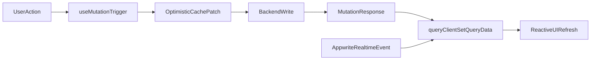

# Frontend Integration Plan

## 1. Overview

This guide defines how the current frontend (gallery, project detail, submission) should integrate with a real backend using Next.js App Router, TanStack Query, and GSAP, while supporting Appwrite Realtime for vote updates.

### Current Baseline
- Existing hooks are mock-based: `useArtifacts`, `useProject`, `useProjectReaction`.
- Existing pages are `/`, `/gallery/[slug]`, and `/submit`.
- Existing submission flow builds `FormData` and simulates a backend call.

### Integration Goals
- Replace mocked query/mutation logic with API service calls while preserving current component contracts.
- Make cache behavior predictable (query keys, stale times, invalidation boundaries).
- Keep vote counts synchronized through Realtime + local cache updates without full page reloads.

### Assumptions
- Backend endpoints below are integration contracts; exact implementation may still be pending.
- Appwrite Realtime is required for vote consistency across clients.
- Frontend should remain App Router-compatible with client hooks for interactivity.

## 2. API Mapping

### API to Feature Mapping

| API Contract | Method | Feature | Frontend Consumer |
| --- | --- | --- | --- |
| `/api/projects` | GET | Gallery listing | Home page (`/`) |
| `/api/projects/{slug}` | GET | Project detail | Project page (`/gallery/[slug]`) |
| `/api/projects/{projectId}/reactions` | POST | Voting/reactions | Vote controls in project sidebar |
| `/api/submissions` | POST | Project submission | Submit page (`/submit`) |

### Notes
- `GET /api/projects` replaces mocked artifacts list.
- `GET /api/projects/{slug}` replaces mocked project detail fetch.
- `POST /api/projects/{projectId}/reactions` replaces mocked reaction mutation.
- `POST /api/submissions` receives multipart form data currently collected in `SubmissionForm`.

## 3. Query & Mutation Design

### Query/Mutation Design

| Feature | Query Key | Type (Query/Mutation) | Trigger | Cache Strategy |
| --- | --- | --- | --- | --- |
| Gallery projects list | `["projects","list",filters]` | Query | Home page mount, filter/sort change | `staleTime: 30-60s`, keep previous data during filter transitions |
| Project detail | `["projects","detail",slug]` | Query | Project route mount, slug change | `staleTime: 15-30s`, scoped per slug |
| Vote/reaction submit | `["projects","vote",projectId]` (mutation key) | Mutation | User clicks vote button | Optimistic update + rollback on error; reconcile on success/realtime |
| Submission create | `["submissions","create"]` (mutation key) | Mutation | Submit form action | No long-lived cache; return status + created resource ID |

### Refetch Rules
- Refetch list query when:
  - User returns to tab and data is stale.
  - Active filters change.
  - Explicit refresh action is triggered.
- Refetch detail query when:
  - Route slug changes.
  - User returns to tab and detail data is stale.
  - Realtime signals project aggregate changed and local patch is insufficient.

### Invalidation Rules
- After successful vote mutation:
  - Prefer `queryClient.setQueryData` for `["projects","detail",slug]` and list row patch.
  - Invalidate only affected keys when backend returns normalized totals mismatch or version conflict.
- After successful submission mutation:
  - Invalidate `["projects","list",*]` only if new entry is expected to appear immediately.
  - Otherwise defer list refresh to normal stale policy.

## 4. Data Flow

### Page-by-Page Data Ownership

| Page | Fetch Location | TanStack Usage | Primary Mutations |
| --- | --- | --- | --- |
| `/` | Client component (interactive list/filter behavior) | `useQuery` for list | None (read-heavy page) |
| `/gallery/[slug]` | Client component (already dynamic + interactive) | `useQuery` for detail, `useMutation` for vote | Vote/reaction mutation |
| `/submit` | Client component (file input + form state) | `useMutation` for submit | Submission mutation |

### Flow: Home Page (`/`)
1. Page mounts.
2. List query executes (`["projects","list",filters]`).
3. UI renders loading skeleton, then populated cards.
4. User navigates to detail page with selected slug.

### Flow: Project Page (`/gallery/[slug]`)
1. Route param resolves slug.
2. Detail query executes (`["projects","detail",slug]`).
3. User clicks vote button.
4. Vote mutation runs; optimistic update can patch local counters.
5. Backend confirms persisted totals/version.
6. Cache is reconciled (`setQueryData`) and UI updates instantly.
7. Realtime event from Appwrite applies same update for all connected clients.

### Flow: Submission Page (`/submit`)
1. User fills local form state and file payload.
2. Submit mutation sends `FormData` to backend.
3. UI shows pending state and prevents duplicate submits.
4. On success: navigate to `/` and optionally trigger list refresh.
5. On error: keep form data visible and show action-oriented error message.



## 5. Realtime Strategy

### Voting Realtime Model
- Subscribe to Appwrite channel(s) for project reaction aggregate updates.
- Keep one subscription lifecycle per relevant screen (project detail, optionally list page).
- On event receive, patch query cache directly:
  - Detail key: `["projects","detail",slug]`
  - List key(s): `["projects","list",filters]` (patch only matching project row)

### Conflict/Reconciliation Policy
- Mutation response is primary immediate truth for the acting client.
- Realtime event is cross-client consistency layer.
- If payload includes `updatedAt`/`version`, apply only newer events to avoid stale overwrite.
- If event payload is partial, patch only aggregate fields (vote counts), never replace full object.

### Why No Full Reload Is Needed
- TanStack cache is the UI source for server state.
- Mutations and Realtime events both write into that cache.
- Components rerender from cache changes, so the route does not need hard refresh.

## 6. State Management

### State Ownership Rules
- Put in TanStack Query cache:
  - Project list data, project detail data, vote aggregates, server validation responses.
- Keep in local component state:
  - Form inputs, selected media thumbnail, modal open/close, temporary animation flags.
- Keep in route state/params:
  - Slug and URL-driven filters.

### Global vs Local Strategy
- Use Query cache as global server-state container.
- Avoid custom global store for data already fetched through query hooks.
- Use local state for ephemeral UI concerns only.

### Examples
- Votes and project stats: Query cache.
- Submission form text fields and file input: local component state/form control.
- `isSubmitting`, hover/focus/expanded state: local state.

## 7. UI/UX Handling

### Loading Patterns
- List and detail pages: skeleton-first for initial load, small spinner for lightweight refetch.
- Mutations: inline pending indicators on the specific action control (vote button, submit button).

### Error Patterns
- Query errors:
  - Show retry CTA and non-blocking message where possible.
  - Keep previously cached data visible during background refetch failure.
- Mutation errors:
  - Show concise actionable feedback.
  - Roll back optimistic vote state if backend rejects mutation.

### Retry Strategy
- Read queries: retry 2-3 times with exponential backoff for transient failures.
- Vote mutation: retry only for transport/network errors; avoid duplicate logical votes on domain errors.
- Submission mutation: no automatic retry; require explicit user retry after correcting issues.

### GSAP Integration Guidance
- Use GSAP on vote click for immediate tactile feedback (button pulse, counter pop).
- Trigger count-change animation only after cache value changes (mutation success or realtime patch).
- Avoid React conflicts:
  - Use refs for animated nodes.
  - Scope/cleanup animations on unmount.
  - Do not derive data state from animation state.

## 8. File Structure

### Proposed Frontend Integration Structure

```text
features/
  projects/
    hooks/
      useProjects.ts
      useProjectDetail.ts
      useVote.ts
    services/
      api.ts
    queryKeys.ts
    components/
      VoteButton.tsx
      ProjectCard.tsx
  submission/
    hooks/
      useSubmitProject.ts
    services/
      api.ts
  realtime/
    useProjectRealtime.ts
lib/
  api/
    client.ts
  query/
    queryClient.ts
    defaults.ts
```

### API to Hook to Component Mapping

| API | Hook | Typical Component Usage |
| --- | --- | --- |
| `GET /api/projects` | `useProjects` | `GallerySection`, project listing blocks |
| `GET /api/projects/{slug}` | `useProjectDetail` | `ProjectDetailLayout`, media/stats panels |
| `POST /api/projects/{projectId}/reactions` | `useVote` | `VoteButton`, reaction controls/sidebar |
| `POST /api/submissions` | `useSubmitProject` | `SubmissionForm` |

## 9. Integration Contract

## Frontend ↔ Backend Contract

### `GET /api/projects`
- Expected request:
  - Query params: `page`, `limit`, optional `sort`, optional filters.
- Expected response:
  - `{ items: ProjectListItem[], pageInfo: { page, limit, total } }`
- Frontend consumption:
  - `useProjects` query stores paged list in cache key with filter params.

### `GET /api/projects/{slug}`
- Expected request:
  - Path param: `slug`.
- Expected response:
  - `ProjectDetail` with stable identifiers and vote aggregates.
- Frontend consumption:
  - `useProjectDetail(slug)` for detail route and dependent UI sections.

### `POST /api/projects/{projectId}/reactions`
- Expected request:
  - `{ reactionType: "radical" | "vibrant" | "complex" | "deadly", clientEventId }`
- Expected response:
  - `{ projectId, stats, updatedAt, version }`
- Frontend consumption:
  - `useVote` mutation patches cache immediately and reconciles with response version.

### `POST /api/submissions`
- Expected request:
  - Multipart `FormData` including `visualPayload`, `projectName`, `tagline`, `teamName`, `description`, `githubRepo`, `videoDemo`, `liveUrl`.
- Expected response:
  - `{ submissionId, status, projectId? }`
- Frontend consumption:
  - `useSubmitProject` mutation drives pending/success/error UI and post-submit navigation.

## 10. Optimization

### Query Performance Defaults
- Projects list: `staleTime` medium (30-60s), moderate cache retention for smooth back-navigation.
- Project detail: shorter `staleTime` (15-30s) due to vote sensitivity.
- Disable aggressive `refetchOnWindowFocus` for list if realtime already active; keep it on for detail when realtime connection is unavailable.

### Refetch Minimization
- Prefer narrow invalidation (`detail` + affected list entries) over global cache busting.
- Use `setQueryData` patches for count-only changes to avoid unnecessary network calls.
- Keep query keys param-stable to prevent duplicate cache entries.

### Mutation Throughput
- Coalesce rapid vote interactions with UI lock/debounce per project.
- Use idempotency token (`clientEventId`) to prevent duplicate writes on retry.
- Batch list-row cache patches when multiple realtime events arrive in short burst windows.

### Operational Summary
- Improved: practical query/mutation lifecycle design, page-level data ownership, and realtime consistency rules.
- Added: API-to-hook/component mapping, cache invalidation/refetch matrix, GSAP-safe trigger points, and explicit frontend/backend contracts.
- Assumptions: contracts are integration-ready targets, Appwrite Realtime is mandatory for vote sync, and current mock hooks are migration placeholders.

